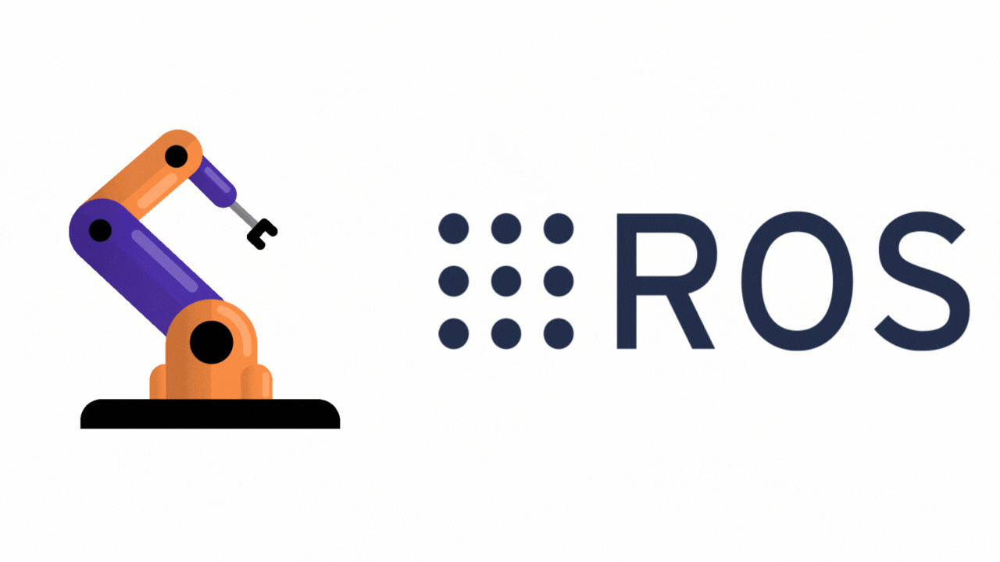

# ROS2-Bootcamp

This repository is a learning workspace for practicing ROS 2.
It combines structured notes, cheat sheets, and Python exercises, with a ready-to-use development container and Docker setup.

## Repository Structure

```
.
├───.devcontainer      # Dev container & Docker setup for VS Code
├───cheatsheets        # Handy cheat sheets for quick reference
├───notes              # Lecture-style notes (with images)
│   └───images
└───python_intro       # Python introduction + OOP exercises
    └───OOP
```

## Quick Links

- [Notes](./notes)  
- [Cheat Sheets](./cheatsheets)  
- [Python Intro Exercises](./python_intro)
- [WSL Setup Guide](./notes/WSL%20setup.md).

## Development Container Setup and Usage

This repo is configured for use with **VS Code Dev Containers** + **Docker**. The container setup is defined under the `.devcontainer` folder.

### Key Path Convention: `/workspaces/ROS2-Bootcamp`

- Inside the container, the repository is mounted at `/workspaces/ROS2-Bootcamp`.
- This path is **defined once** in `.devcontainer/devcontainer.json` and `.devcontainer/Dockerfile`.
- All workspace-related commands and source scripts use this path, so it is crucial to keep this path consistent for proper operation.

### How to Set Up the Workspace on Your Machine

1. **Create a folder on your local machine** where you want to keep your projects, e.g., `~/ros2_workspace`.

2. **Open a terminal in that folder and clone this repository:**

   ```bash
   git clone https://github.com/yourusername/ROS2-Bootcamp.git

3. **Open the folder in VS Code:**

Open VS Code and select "Open Folder" → your `ROS2-Bootcamp` folder.

4. **Start the development container:**

- When prompted by VS Code, reopen the folder inside the Dev Container.
- This will build the container image (if not built) based on the `.devcontainer/Dockerfile`.
- The container mounts your local code at `/workspaces/ROS2-Bootcamp` inside the container.

5. **Access the workspace inside the container:**

The workspace folder inside the container is `/workspaces/ROS2-Bootcamp` and all commands, scripts (e.g., `setup_ws.sh`), and environment setups rely on this.

### Important Configuration Locations Using the Workspace Path

You must update path if changing the workspace directory:

*Devcontainer:*

- `"workspaceFolder": "/workspaces/ROS2-Bootcamp"`

*Docker file:*

- `ARG WsF=/workspaces/ROS2-Bootcamp`  

Any scripts or commands relying on this path

### Running and Using the Container

- The user inside the container is `nico` (default username), with passwordless sudo.
- The container runs with network, IPC, and PID namespaces shared (`--net=host`, etc.) to enable ROS 2 networking.
- Port forwarding is disabled by default in the container settings for simplicity.
- The container mounts device files for GUI access, enabling tools such as RViz.
- The `setup_ws.sh` script is added to the user's `.bashrc` to source the ROS 2 workspace environment automatically.

## WSL Setup (Alternative to VS Code Dev Containers)

You can also set up and run this repository directly inside Windows Subsystem for Linux (WSL2) with Ubuntu 24.04.

 - This guide is included alongside the notes (notes/wsl_setup.md).
 - Using WSL lets you run a full Ubuntu environment directly on Windows without a virtual machine.
 - Docker Desktop integrates with WSL2, so you can build and run the same ROS 2 container setup from inside Ubuntu on Windows.
 - The project structure remains the same — your ROS2-Bootcamp folder will live inside WSL, right next to the other notes and exercises.
 - This makes it possible to:
 - Use ROS 2 on Windows through WSL.
 - Keep everything in one place with your notes, cheat sheets, and Python exercises.
 - Push your work to your own GitHub repo as usual.

For the detailed installation and configuration steps, see: [WSL Setup Guide](./notes/WSL%20setup.md).

## Purpose
This repository is both a study resource and a practice environment:

 - Notes explain the theory behind ROS 2 concepts.
 - Cheat sheets give you quick reference material.
 - Python exercises build programming fundamentals.

Dev container setup ensures you can reproduce the environment on any machine with Docker + VS Code.
