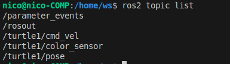
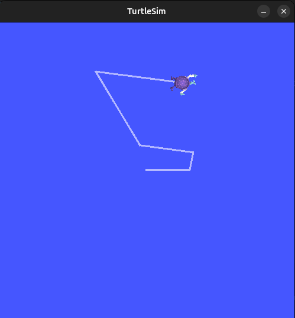
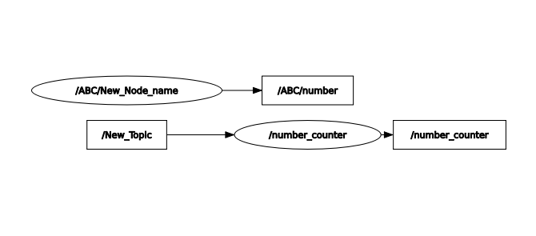

# ROS2 - Bootcamp

Robotics today is undergoing a transformation, moving rapidly from research labs into industrial and commercial applications. One of the biggest drivers of this change has been the adoption of open-source frameworks that allow engineers and researchers to share tools, build upon existing work, and standardize solutions across different domains. The **Robot Operating System (ROS)** has become one of the most influential of these frameworks. Initially developed as ROS1, it provided a modular, flexible foundation for developing robotic applications. However, ROS1 was not without limitations, especially when it came to scalability, real-time performance, and long-term support. To address these challenges, the next generation, **ROS2**, was created.

ROS2 represents a step toward standardization in robotics software development. Increasingly, companies in industry are adopting ROS2 as a backbone for their robotic systems, from autonomous mobile robots (AMRs) in warehouses to collaborative arms in manufacturing. Unlike ROS1, ROS2 is designed with modern requirements in mind: real-time communication, security, multi-platform support, and better integration with industrial middleware. This means that ROS2 is not just a tool for prototyping in academia, but a framework with the reliability and scalability needed for production environments.

One of the strengths of ROS2 is that it provides **working functionalities out of the box**, while still allowing developers to extend and customize systems. For example, basic building blocks such as navigation, perception, and manipulation libraries are readily available. Instead of reinventing the wheel, engineers can build on top of these established tools and focus their efforts on solving domain-specific challenges. This accelerates development, improves reliability, and ensures compatibility with a growing ecosystem of robots and sensors.

Since ROS2 is built on the lessons learned from ROS1, it is important to note some key differences. ROS1 relied on a centralized master for communication, while ROS2 uses a peer-to-peer approach enabled by DDS (Data Distribution Service), which allows for more scalable and robust communication. ROS2 also supports real-time control, is more secure, and offers a much longer support horizon, which is critical for industry adoption.

Now, while ROS2 provides the framework, the question becomes: _How do we set it up in a way that is consistent, reproducible, and easy to share?_ This is where **Docker** comes into play. Docker has become the **gold standard** in industry for packaging and deploying software. Instead of spending hours configuring dependencies and worrying about whether a setup will work on a new machine, Docker allows us to create containers that bundle everything needed to run an application. These containers can then be shared, deployed, and executed consistently across different environments.

In this course, we will not have the time to explain Docker in its entirety it is a large topic with many advanced features. Instead, we will focus on the basics: how to use Docker to run ROS2 without headaches, and how to start building on top of a pre-prepared container. To make things easier, I have already created a Docker image and container for you, so you can jump directly into working with ROS2. Think of it as starting with a ready-to-go toolbox: instead of spending time buying and organizing the tools, you can immediately begin building.

By combining ROS2 with Docker, we are setting ourselves up for a workflow that mirrors what is increasingly used in industry. This approach gives you the confidence that your code and projects will run consistently on different machines, whether on your laptop, a lab workstation, or a production robot. In the following sections, we will explore how to use this setup effectively and begin experimenting with ROS2 functionalities.


# Course Overview

This guide takes you step by step from the very basics of ROS 2 all the way to building a small but complete project where everything comes together. The idea is to make ROS 2 less intimidating and show that with the right setup and a bit of practice, anyone can build real robotic applications. Things start with setting up a reliable development environment using Docker and VS Code devcontainers. That might sound fancy at first, but the benefit is simple: no more “it works on my machine” problems — everyone has the same setup, and it works everywhere. Before touching ROS 2 itself, there’s also a quick run-through of the most useful Git and Linux commands. These tools are the everyday language of robotics projects, and learning them early makes the rest of the journey much smoother.

Once the environment is ready, the focus shifts to ROS 2. The first step is creating a workspace and learning how to build packages. From there, things get practical: writing Python nodes, sending and receiving data with publishers and subscribers, and experimenting with topics to see how nodes communicate. To make sense of what’s happening inside the system, visualization and debugging tools like RQT are introduced, along with `ros2 bag`, which lets you record and replay experiments even if the robot isn’t available at the moment.

As the concepts grow, the guide covers services (so nodes can request actions from each other), custom interfaces (so you can design your own messages that fit your project), and parameters (so nodes can be configured without changing code). To manage everything efficiently, launch files are introduced, showing how multiple nodes can be started, remapped, and configured with one simple command.

In the end, all of these building blocks are combined into a single project that pulls everything together: custom messages, services, parameters, launch files, data recording, and a reproducible Docker setup. The result is not just a working application but also a clear picture of how ROS 2 can be used in real robotics projects.

A roadmap of what’s included:

- Setting up a reproducible ROS 2 environment with Docker and VS Code devcontainers
- Basics of Git and Linux commands for everyday project management
- Initializing a ROS 2 workspace, creating packages, and building with `colcon`
- Writing and running Python nodes, understanding topics, publishers, subscribers, and QoS
- Using RQT for visualization and debugging, and `ros2 bag` for recording and replaying data
- Implementing services (client/server), both synchronous and asynchronous
- Designing custom interfaces with `.msg` and `.srv` files and making them work in nodes
- Working with parameters and YAML configuration files
- Writing launch files to start and configure multiple nodes efficiently
- Building a final project that ties everything together into one complete robotic system

# ROS1 vs ROS2

ROS1 and ROS2 are both middleware frameworks for building robotic applications, but they differ significantly in architecture and capabilities. ROS1 relies on a centralized master node (`roscore`) and custom communication protocols like XML-RPC and TCPROS. This works well for research but limits scalability, real-time performance, and security. In contrast, ROS2 replaces the central master with **DDS (Data Distribution Service)**, an industry-standard middleware for real-time distributed systems. DDS provides a peer-to-peer communication model with **Quality of Service (QoS) policies**, enabling fine control over how data is delivered (e.g., reliability, deadlines, latency). It also brings built-in support for **security (authentication, encryption)** and better handling of **multi-robot systems**. Additionally, ROS2 offers cross-platform support (Linux, Windows, macOS, and RTOS), managed node lifecycles, and a modern build system (`ament_cmake`, `colcon`). Overall, ROS2 is designed for real-world industrial use where reliability, scalability, and flexibility are critical. Because of these improvements, ROS2 has moved beyond being just a research tool and is now considered a foundation for industrial robotic applications.

| Feature           | ROS1                           | ROS2                                |
| ----------------- | ------------------------------ | ----------------------------------- |
| Communication     | TCPROS, XML-RPC                | DDS with QoS policies               |
| Architecture      | Centralized master (`roscore`) | Decentralized peer-to-peer          |
| Real-time support | Limited                        | Designed for real-time              |
| Security          | Minimal                        | Built-in authentication, encryption |
| Platforms         | Mostly Linux                   | Linux, Windows, macOS, RTOS         |
| Build system      | `catkin`                       | `ament_cmake`, `colcon`             |


# SETUP

Before we can start working with ROS2, we need to prepare our development environment. In this section, we will install and configure the essential tools: update the system, install Docker, and set up Visual Studio Code. Docker will ensure that our projects run consistently across machines, while VS Code with Remote Development will provide a modern and efficient workflow.

First, we need to update and upgrade our system:

- **`sudo apt update`** – This refreshes the list of available packages so we know about the latest versions.
- **`sudo apt upgrade -y`** – This upgrades all installed packages to their newest versions. We do this to fix security issues, ensure compatibility, and avoid problems when installing new software like Docker.

## Installing Docker and Configuring User Permissions

Execute the following commands:

```bash
sudo apt install docker.io git python3-pip
pip3 install vcstool
echo export PATH=$HOME/.local/bin:$PATH >> ~/.bashrc
source ~/.bashrc
sudo groupadd docker
sudo usermod -aG docker $USER
newgrp docker
```

**Explanation of Steps:**

- `docker.io`: Installs the Docker engine, which is required to run containers.
- `git`: Provides version control for cloning ROS 2 repositories.
- `python3-pip`: Installs Python’s package manager, needed for installing development tools such as `vcstool`.
- `vcstool`: Facilitates management of multiple repositories within a ROS 2 workspace.
- Adding `~/.local/bin` to the PATH ensures that installed Python tools are globally accessible.
- Creating a `docker` group and adding your user account allows Docker commands to be executed **without requiring root privileges**, simplifying workflow.

Verify the installation:

```bash
docker run hello-world
```

If Docker cannot run immediately, start the Docker daemon with:

```bash
sudo systemctl start docker
```

## Installing Visual Studio Code

To verify if Visual Studio Code is installed, run:

```bash
code --version
```

If VS Code is **not installed**, you can install it using a `.deb` package:

```bash
sudo apt install ./<file>.deb
```

Alternatively, automatically accept Microsoft repository prompts before installation:

```bash
echo "code code/add-microsoft-repo boolean true" | sudo debconf-set-selections
```

Install Remote Development Extension in VScode. This extension allows VS Code to connect seamlessly to a Docker container, providing a fully isolated development environment for ROS 2 projects.

## Configure Workspace in Docker and VS Code

To make development with ROS2 smooth, maintainable, and consistent across different systems, we will set up a **dedicated workspace** that runs inside a Docker container and is accessible through Visual Studio Code. This setup mirrors how many companies structure their robotics projects in industry today:

- A **workspace** (`ws`) keeps all your ROS2 packages and source code organized.
- A **`.devcontainer` folder** defines how VS Code connects to Docker and ensures everyone working on the project has the same environment.
- Docker provides isolation from your host system, so you don’t break your local setup when experimenting.
- VS Code with the Remote Development extension makes it feel like you are coding directly on your machine, while in reality all compilation and execution happens inside the container.

By the end of this step, you will have a ready-to-use development environment where you can build, run, and test ROS2 packages without worrying about dependency issues.

To set up a ROS 2 workspace that can be built and accessed inside a Docker container, follow these steps:

**ws 
├── .devcontainer 
│ ├── devcontainer.json 
│ └── Dockerfile 
├── src 
├── package1 
└── package2**

```bash
//Create the workspace directory structure:
cd ~/
mkdir -p ws/src
cd ws
```

**Create the `.devcontainer` folder for Docker configuration:**

```bash
mkdir .devcontainer
```

Inside `.devcontainer`, you will place two important files:
- **`devcontainer.json`** → Tells VS Code how to launch and connect to the container. It defines the base image, extensions, workspace mounting, and other settings.
- **`Dockerfile`** → Defines the actual container image. Here you specify the ROS 2 distribution, system dependencies, and any extra tools you want installed.

**Open VS Code in the workspace folder:**

```bash
cd ~/ws
code .
```

- The `code .` command opens VS Code in the current folder (`ws`).
- With the **Remote Development** extension, VS Code can now work directly inside the Docker container.

**Configure your container environment:**

- inside the `.devcontainer` folder edit the `devcontainer.json` file.
- This file defines your development environment, including:
    - Base Docker image (e.g., a ROS 2 distribution)
    - Required extensions for VS Code
    - Workspace mounts and settings

## devcontainer.json

```json
{
    "name": "ROS 2 Development Container",
    "privileged": true,
    "remoteUser": "nico",
    "build": {
        "dockerfile": "Dockerfile",
        "args": {
            "USERNAME": "nico"
        }
    },
    "workspaceFolder": "/home/ws",
    "workspaceMount": "source=${localWorkspaceFolder},target=/home/ws,type=bind",
    "customizations": {
        "vscode": {
            "extensions":[
                "ms-vscode.cpptools",
                "ms-vscode.cpptools-themes",
                "twxs.cmake",
                "donjayamanne.python-extension-pack",
                "eamodio.gitlens",
                "ms-iot.vscode-ros"
          ],
            "settings": {
                "remote.containers.autoForwardPorts": false,
                "remote.autoForwardPorts": false,
                "remote.portsAttributes": {
                    "0-65535": {
                        "onAutoForward": "ignore"
                    }
                }
            }
        }
    },

    "containerEnv": {
        "DISPLAY": "unix:0",
        "ROS_AUTOMATIC_DISCOVERY_RANGE": "LOCALHOST",
        "ROS_DOMAIN_ID": "42"
    },
    "runArgs": [
        "--net=host",
        "--pid=host",
        "--ipc=host",
        "-e", "DISPLAY=${env:DISPLAY}"
    ],
    "mounts": [
        "source=/tmp/.X11-unix,target=/tmp/.X11-unix,type=bind,consistency=cached",
        "source=/dev/dri,target=/dev/dri,type=bind,consistency=cached",
        "source=ros2_build_cache,target=/home/ws/build,type=volume",
        "source=ros2_install_cache,target=/home/ws/install,type=volume",
        "source=ros2_log_cache,target=/home/ws/log,type=volume"
    ],
    "postCreateCommand": "bash -c \\"grep -qxF 'source /home/ws/setup_ws.sh' /home/nico/.bashrc || echo 'source /home/ws/setup_ws.sh' >> /home/nico/.bashrc\\""

}
```

## Dockerfile

The `Dockerfile` describes how our development environment will be built. It begins with the official ROS 2 Jazzy base image:

```
FROM ros:jazzy
```

This image already contains the ROS 2 core libraries, so we don’t need to start from scratch. On top of it, we update the system, install some everyday tools, and add a dedicated user inside the container to avoid running everything as root:

```
RUN apt-get update && apt-get upgrade -y && apt-get install -y python3-pip nano
```

Creating a user inside the container helps mirror how things are done on real systems, and prevents permission conflicts when mounting your workspace.

The next part of the Dockerfile installs several useful ROS 2 packages:

```
RUN sudo apt-get install -y \     
	ros-jazzy-demo-nodes-cpp \     
	ros-jazzy-ros-base \     
	ros-jazzy-demo-nodes-py \     
	ros-jazzy-rviz2 \    
	ros-jazzy-ros2cli \     
	ros-jazzy-teleop-twist-keyboard \     
	ros-jazzy-turtlesim
```

These packages provide a solid foundation to start experimenting immediately — from simple publisher/subscriber examples, to visualization in RViz, to interactive tools like `turtlesim` and teleoperation.

Finally, we set the workspace directory and default user:

```
WORKDIR /home/ws USER $USERNAME ENV SHELL /bin/bash
```

This ensures that when the container starts, you are dropped directly into your ROS 2 workspace with Bash as the shell, ready to build and run packages in a familiar environment. And below we can see full Dockerfile we use in our project.

```docker
FROM ros:jazzy
ARG USERNAME=USERNAME
ARG USER_UID=1000
ARG USER_GID=$USER_UID

# Delete user if it exists in container (e.g Ubuntu Noble: ubuntu)
RUN if id -u $USER_UID ; then userdel `id -un $USER_UID` ; fi

# Create the user
RUN groupadd --gid $USER_GID $USERNAME \\
    && useradd --uid $USER_UID --gid $USER_GID -m $USERNAME \\
    #
    # [Optional] Add sudo support. Omit if you don't need to install software after connecting.
    && apt-get update \\
    && apt-get install -y sudo \\
    && echo $USERNAME ALL=\\(root\\) NOPASSWD:ALL > /etc/sudoers.d/$USERNAME \\
    && chmod 0440 /etc/sudoers.d/$USERNAME
# Base system updates + tools
RUN apt-get update && apt-get upgrade -y \\
    && apt-get install -y \\
        python3-pip \\
        nano \\            
    && rm -rf /var/lib/apt/lists/*

ENV SHELL /bin/bash

# ********************************************************
# * Anything else you want to do like clean up goes here *
# ********************************************************
# Install ROS2 demo nodes (talker/listener)
RUN sudo apt-get update && sudo apt-get install -y \\
    ros-jazzy-demo-nodes-cpp \\
    ros-jazzy-ros-base \\
    ros-jazzy-demo-nodes-py \\
    ros-jazzy-rviz2 \\
    ros-jazzy-ros2cli \\
    ros-jazzy-teleop-twist-keyboard \\
    ros-jazzy-turtlesim \\
    #ros-jazzy-slam-toolbox \\
    #ros-jazzy-nav2-bringup \\
 && sudo rm -rf /var/lib/apt/lists/*

# Source ROS automatically in bash
#RUN echo "source /opt/ros/jazzy/setup.bash" >> /home/$USERNAME/.bashrc

# Set the default user. Omit if you want to keep the default as root.
USER $USERNAME
WORKDIR /home/ws
CMD ["/bin/bash"]
```


### Installing dependencies with `rosdep`

Once the Dockerfile is complete, it’s a good idea to make sure any additional dependencies from your ROS 2 packages can be installed automatically. As beginners we won’t rely on this right away, since we only need a few core packages, but once you work on larger projects or start cloning repositories from others it becomes almost mandatory. Instead of manually adding every `apt` package to the Dockerfile, you can use **rosdep**, the standard ROS dependency manager.

`rosdep` looks at the `package.xml` files in your workspace and installs all required system dependencies. This way, if you or a collaborator add a new dependency later, you don’t need to update the Dockerfile — just run `rosdep install`.

To enable this workflow, add `rosdep` to your container:

```bash
RUN sudo apt-get update && sudo apt-get install -y python3-rosdep && \
	sudo rosdep init && \
	rosdep update
```

Then, after building your Docker container and opening the workspace inside it, you can run:

```bash
cd /home/ws rosdep install --from-paths src --ignore-src -r -y
```

This ensures every package in your `src/` folder has its dependencies installed automatically, keeping your workspace portable and future-proof.

## Build and open the workspace in the Docker container

Before building the container, we need to make sure that the **workspace setup script** exists. This script automates sourcing of ROS 2 and your workspace, so that every new terminal session inside the container is ready for development.

**Why we need the script:**

Sourcing means loading environment variables and paths so that ROS 2 can find your packages, executables, and messages. Without sourcing, your shell won’t know where to find workspace packages. Normally, sourcing is temporary per terminal session — you would need to do it every time you open a new terminal. By automating it with a script, we ensure both the base ROS 2 installation and your workspace environment are always available.

**Create a workspace setup script**

Inside your workspace (`/home/ws`), create a file named `setup_ws.sh`:

```
nano /home/ws/setup_ws.sh
```

Now that both the `Dockerfile` and `devcontainer.json` are ready, we can let VS Code take care of the rest. The editor will build the container, configure it based on your settings, and then reopen your workspace inside that container.

Paste the following:

```sh
#!/bin/bash
# Source base ROS 2 installation
source /opt/ros/jazzy/setup.bash

# Source workspace install setup if it exists
if [ -f /home/ws/install/setup.bash ]; then
    source /home/ws/install/setup.bash
fi
```

his script starts with `#!/bin/bash` to run it with Bash. `source /opt/ros/jazzy/setup.bash` loads the base ROS 2 environment, while the `if` block checks for and sources your workspace setup (`/home/ws/install/setup.bash`) if it exists. Together, this ensures every terminal automatically has ROS 2 and your workspace packages ready, so you can run nodes and access messages without manually sourcing each time.

Make the script executable:

```
chmod +x /home/ws/setup_ws.sh
```

An **executable file** is a file your operating system can **run as a program or script**. By default, text files are just data. When you make a file executable (`chmod +x filename`), you tell Linux it can be run like a command.

Instead of running it with:

```
bash setup_ws.sh
```

you can now simply run:

```
./setup_ws.sh
```

or

```
. ./setup_ws.sh
```

This ensures your environment is correctly set up before the container build.

## Now build the container in VS Code:

- Press `CTRL + SHIFT + P` in VS Code to open the Command Palette.
- Start typing `Dev Containers: (Re-)build and Reopen in Container`.
- Select it and press Enter.

The first time you run this, the build may take several minutes because Docker needs to download the ROS 2 base image and install all required packages. After that, subsequent rebuilds will be much faster.

This command will:

- Build the Docker container according to the `Dockerfile` and `devcontainer.json`.
- Reopen your VS Code workspace inside the container.
- Ensure that all dependencies and environment settings are applied, providing a consistent ROS 2 development environment.

Once the container has started, you can verify everything is working by opening a new terminal inside VS Code and running:

```
ros2 run demo_nodes_cpp talker
```

If the command executes without errors, your containerized workspace is correctly set up and ready for development.


# Workspace Initialization

Once the container is running, there are a few important steps to prepare your development environment. These include verifying the container, setting up version control, and ensuring your ROS 2 workspace is built and sourced correctly.

**Verify Running Container**

First, confirm that the container is active:

```bash
docker ps
```

You should see your ROS 2 development container listed among the running containers. If it’s not there, check your VS Code setup or rebuild the container.

## Build the ROS 2 Workspace

Before working with any ROS 2 packages, we need to make sure the workspace is built and properly **sourced**. Building compiles all packages and prepares them for execution, while sourcing loads the necessary environment variables so that ROS 2 knows where to find your packages, executables, and messages. Without sourcing, commands run in your terminal won’t be able to locate your workspace content. Note that sourcing is temporary per terminal session, if you open a new terminal, you would normally need to source again.

From the root of your workspace (`/home/ws`), run:

```bash
colcon build
```

Since we’ve already set up **automated sourcing** with `setup_ws.sh`, the workspace will be sourced automatically in every new terminal inside the container. You don’t need to manually source it unless you want to override or test it:

```
. ./setup_ws.sh   # optional if you want to manually source
```


## Setup Git Repository

Version control is essential to keep your work safe and synchronized.
We will use **Git** and push the workspace to **GitHub**.

#### 1. Initialize the repository (only once)

If your workspace isn’t already a Git repo, initialize it:

```bash
git init
```

#### 2. Connect to your remote GitHub repository

Replace the link with your own GitHub repo URL:

```bash
git remote add origin <https://github.com/niko-korosec-student/Docker-Ros2.git>
```

Check that the remote was added correctly:

```bash
git remote -v
```

#### 3. Configure Git (only once per system)

If not already set, configure your username and email:

```bash
git config --global user.name "Your Name"
git config --global user.email "your.email@example.com"
```

#### 4. Add and commit your files

```bash
git add .
git commit -m "Initial commit: ROS 2 workshop setup"
git branch -M main     # make sure the branch is called main
git push -u origin main
```

 **Important:**
- Make sure you are logged in to GitHub (either via **SSH keys** or **GitHub CLI** or **HTTPS with a Personal Access Token**).
- If you see `fatal: could not read Username for '<https://github.com>'`, it means authentication is not set up yet.


# ROS2 – Creating a Package

In ROS2, everything starts with a **package**, which organizes your code into reusable units. For instance, one package could handle a camera, another could control the wheels, and a third could manage motion planning. This modular structure makes your project easier to manage, extend, and maintain.

To create a new package, first navigate to the `src` folder inside your workspace, since all packages are stored there:

```bash
cd /home/ws/src
```

## Create a Python package

ROS2 supports both Python and C++ packages. Here, we will focus on Python. You can create a package using the `ros2 pkg create` command, specifying the build type and dependencies. For example:

```bash
ros2 pkg create <package_name> --build-type ament_python --dependencies rclpy
```

For example:

```bash
ros2 pkg create my_py_pkg --build-type ament_python --dependencies rclpy
```

- `-build-type ament_python` → specifies that this is a Python-based package.
- `-dependencies rclpy` → automatically adds the **rclpy** library (the Python client library for ROS 2).

This command tells ROS2 that the package is Python-based and automatically includes **rclpy**, the Python client library for ROS2.

After creation, explore the package folder. The key files are `package.xml`, which defines metadata like the package name, version, and dependencies, and `setup.py`, which instructs ROS 2 how to install and run your package.

Once you’re ready, go back to the root of your workspace and build the package with:

```bash
cd /home/ws
colcon build
```

After building, your new Python package is ready to use within ROS2.

However, once your workspace grows, it’s often more efficient to build only the package you’re currently working on instead of the entire workspace. You can do this with:

```bash
colcon build --packages-select my_py_pkg
```

This command compiles **only the selected package**, saving time while allowing you to quickly test changes without rebuilding everything.


# ROS2 - nodes

A **node** in ROS 2 is a **separate, executable program** that performs a single, well-defined task. You can think of it as a small application within your robot’s software. Each node runs in its **own process** and can communicate with other nodes, while nodes themselves are organized into **packages**, which act as folders containing related nodes, libraries, and configuration files.

**Example**:

Imagine a robot with a camera and wheels:

- **Camera package**
    - `camera_driver_node` → reads images from the camera hardware.
    - `image_processing_node` → takes camera images and processes them.
- **Motion planning package**
    - `motion_planner_node` → calculates trajectories.
    - `path_correction_node` → adjusts paths based on sensor data.
- **Hardware control package**
    - `motor_driver_node` → sends commands to the motors.
    - `main_control_node` → executes motion commands from the planner.
    - `state_publisher_node` → publishes the robot’s current status.


Nodes form a **graph of programs** that communicate with each other using **ROS 2 Topics, Services, and Parameters**. The benefits of using nodes include:

- **Reduced code complexity:** By separating functionality into individual nodes and packages, each part of your application remains modular and easier to manage.
- **Scalability:** New nodes and packages can be added without affecting existing ones, making it simple to expand your system.
- **Fault tolerance:** Nodes run in separate processes. If one node crashes, others continue running and communicating via ROS 2, preventing a single failure from taking down the entire system.
- **Language flexibility:** Nodes written in Python and C++ can seamlessly communicate with each other, allowing you to use the best language for each task.

Now that you know what a node is, let's create one in Python using OOP.

## Creating Your First Python Node

Start by navigating to your package folder inside the workspace:

```bash
cd ~/ws/src/my_py_pkg/my_py_pkg
```

- `cd` means “change directory.”
- `~/ws/src/my_py_pkg/my_py_pkg` is the folder inside your ROS 2 workspace where the package files are located.

Next, create a new Python file for the node:

```bash
touch my_first_node.py
```

The `touch` command creates an empty file named `my_first_node.py`, which you can now open in a text editor to write your node code.

Here’s a basic example of a ROS 2 Python node using object-oriented programming:

```python
BASIC OOP ROS2 Node Setup

#!/usr/bin/env python3   # Interpreter directive: ensures the script runs with Python 3

import rclpy                 # ROS 2 client library for Python
from rclpy.node import Node  # Base Node class used to create custom nodes

# Define a custom ROS 2 node by inheriting from the Node class
"""
This node uses object-oriented programming (OOP) by defining a class `MyNode` that inherits from `Node`. OOP lets us bundle data and behavior together, making the node easier to extend, maintain, and reuse in larger projects.
"""
class MyNode(Node):  
    def __init__(self):
        # Initialize the parent Node with the name "py_test"
        super().__init__("py_test")
        # Log a message to the terminal (visible when the node starts)
        self.get_logger().info("Hello world")

def main(args=None):
    # Step 1: Initialize the ROS 2 communication system
    rclpy.init(args=args)
    # Step 2: Create an instance of our custom node
    node = MyNode()
    # Step 3: Keep the node running so it can process data and callbacks
    # (Without this, the program would exit immediately after creating the node)
    rclpy.spin(node)
    # Step 4: Shutdown ROS 2 when the node stops
    rclpy.shutdown()

# Run the main() function if this file is executed directly from the terminal
if __name__ == "__main__":
    main()

```

**Tip:** If you’re unsure about Python syntax or OOP, check a Python cheat sheet for reference.

![[Python_cheatsheet_FULL.pdf]]

## Template Node

This simplified version is essentially a **template for new nodes**. It shows the minimal structure needed to create a ROS 2 Python node using object-oriented programming. The `MyNode` class inherits from `Node`, and the `main()` function handles initialization, spinning, and shutdown. You can copy this template and extend it with publishers, subscribers, timers, or custom logic for any new node you want to create.

```python
#!/usr/bin/env python3

import rclpy
from rclpy.node import Node 

class MyNode(Node):  
    def __init__(self):
        super().__init__("Template")
    

def main(args=None):
    rclpy.init(args=args)
    node = MyNode()
    rclpy.spin(node)
    rclpy.shutdown()
    

if __name__ == "__main__":
    main()
```

## Running Your Python ROS 2 Node

Once you’ve written your Python ROS 2 node, the next step is to run it and verify that it works as expected. Running a node starts the ROS 2 process, allowing it to communicate with other nodes, publish or subscribe to topics, and perform its designated tasks. Before doing this, it’s essential to **save your file**, as unsaved changes won’t be executed. Properly running your node is a key step in the development workflow, letting you test

Start by navigating to the folder containing your node script:

```bash
cd ~/ws/src/my_py_pkg/my_py_pkg
```

This is the same folder where `my_first_node.py` is located.

You have a few ways to run the node. The simplest is directly with Python:

```bash
python3 my_first_node.py
```

Alternatively, you can make the file executable and run it like a standalone program:

```bash
chmod +x my_first_node.py   # Make the file executable
./my_first_node.py          # Run the script directly
```

Making the file executable allows you to run it like a standalone program without typing python3.

To integrate the node into ROS 2 so it can be launched via `ros2 run`, you need to add it to the `setup.py` file in your package. Locate the `entry_points` section and add:

```python
entry_points={
    'console_scripts': [
        "py_node = my_py_pkg.my_first_node:main"
    ],
}
```

- `py_node` → the executable name you’ll use with `ros2 run` (you can choose any name).
- `my_py_pkg.my_first_node` → Python module path to your node file.
- `main` → function to execute when running the node.
- file needs to be executable


Next, go back to your workspace root to build the package:

```bash
cd ~/ws
colcon build --packages-select my_py_pkg
```

Using `--packages-select` builds only your package, saving time compared to rebuilding the entire workspace. After building, an executable for your node will appear in the `install` folder.

Once built, you can run your node from **anywhere** with:

```bash
ros2 run my_py_pkg py_node
```

If it doesn’t run immediately, open a new terminal to ensure the environment is correctly sourced.

**Node Naming Tips:**

- **Node name:** `py_test` – internal ROS 2 identifier.
- **Script file:** `my_first_node.py` – your source file.
- **Executable name:** `py_node` – used with `ros2 run`.

You can run the node in multiple ways (`python3 my_first_node.py`, `./my_first_node.py`, or `ros2 run my_py_pkg py_node`), but using `ros2 run` is the recommended approach during development. This workflow allows you to quickly test nodes while keeping them fully integrated into your ROS 2 system.


## Creating a Periodic Timer Node in ROS 2

In ROS 2, nodes can perform tasks periodically using **timers**. In this example, we will create a node that prints a message every second for as long as it is running. This demonstrates how to schedule recurring tasks in ROS 2 using Python.

First, navigate to your package folder:

```bash
cd ~/ws/src/my_py_pkg/my_py_pkg
```

Then create a new Python file for the node and make it executable:

```bash
touch timer_node.py
chmod +x timer_node.py   # Make it executable
```

Now open `timer_node.py` and add the following code:

```python
#!/usr/bin/env python3

import rclpy
from rclpy.node import Node 

class MyNode(Node): 
    def __init__(self):
        super().__init__("timer") # Node name in ROS 2
        self.counter_ = 0
        self.get_logger().info("Hello for the first time")
        
        # Create a timer that triggers every 1.0 second
        # Note: we pass the function reference, not its return value
        self.create_timer(1.0, self.timer_callback)
        
    # Timer callback function
    def timer_callback(self):
	    """Callback function executed every time the timer triggers."""
        self.get_logger().info(f"Hello {str(self.counter_)}")
        self.counter_ += 1
    
def main(args=None):
    rclpy.init(args=args)     # Initialize ROS 2
    node = MyNode()    # Create an instance of our custom node
    rclpy.spin(node)   # Keep the node alive
    rclpy.shutdown()     # Cleanup when the node is stopped

if __name__ == "__main__":
    main()
```

To make this node runnable through ROS 2 commands, add it to the `entry_points` section of your `setup.py`:

```python
entry_points={
    'console_scripts': [
        "timer_node = my_py_pkg.timer_node:main"
    ],
}
```

Then build the package from your workspace root:

```bash
cd ~/ws
colcon build --packages-select my_py_pkg
```

Once built, the node can be run from anywhere using:

```bash
ros2 run my_py_pkg timer_node
```

This simple timer node is a **practical template**. You can modify the timer interval or the callback function to perform more complex periodic tasks, making it easy to extend and reuse in other projects.


## ROS 2 Command line Tools

With your ROS 2 workspace ready, it’s time to explore some of the most commonly used tools that help you inspect, debug, and interact with your system.

### Listing Nodes

To see all currently running nodes, use:

```bash
ros2 node list
```

- If no nodes are running, the list will be empty.
- Start a node in a new terminal:

```bash
ros2 run my_py_pkg py_node
```

- Then run the list command again:

```bash
ros2 node list
```

and run the list command again. You should now see the name of your running node displayed. This is a quick way to verify that your nodes are active.

### Running Multiple Instances of a Node

Sometimes you need multiple instances of the same node, for example if you have several sensors using the same software. Each node instance must have a unique name to avoid conflicts. You can rename a node when launching it like this:

```bash
ros2 run my_py_pkg py_node --ros-args --remap __node:=NEW_name
```

Replace `NEW_name` with a unique identifier for each instance. This ensures all nodes can coexist and communicate properly.

### Building and Modifying Python Nodes

When you make changes to Python code in a package, you typically need to build the package:

```bash
colcon build
```

To avoid rebuilding every time, use **symlink install**:

```bash
colcon build --packages-select my_py_pkg --symlink-install
```

This allows you to modify Python files without recompiling the whole package.

A **symlink** (short for _symbolic link_) is a special type of file in Linux that points to another file or directory, similar to a shortcut in Windows. When you build a ROS 2 Python package with the `--symlink-install` option, the installed files in the workspace are not copied; instead, symbolic links are created that point directly to your source files. This means that when you edit the Python code in your `src/` directory, the changes are immediately reflected in the installed workspace without needing to rebuild. It makes development faster and more convenient

### RQT – Graphical Debugging Tool

**RQT** is a collection of graphical tools in ROS 2 that provide a convenient way to visualize, inspect, and debug the system. Instead of relying only on command-line tools, RQT offers a GUI where you can explore nodes, topics, parameters, and messages in real time. It is built on top of the Qt framework and is modular, meaning you can add plugins for different tasks

Start RQT:

```bash
rqt
```

Initially, the interface will be empty because no nodes are running.

Start a node:

```bash
ros2 run my_py_pkg py_node
```

Open the **RQT Graph**:

```bash
rqt_graph
```

You will see a graphical representation of all nodes and topics.

- Nodes typically publish to a topic called `rosout`, where log messages are collected.

### Turtlesim – Simple Robot Simulation

Turtlesim is a 2D simulator included with ROS 2, ideal for learning and experimenting with nodes, topics, services, and parameters. You control a turtle in a window instead of a real robot, which makes testing and demonstrations safe and intuitive.

Launch the Turtlesim node:

```bash
ros2 run turtlesim turtlesim_node
```

A 2D window will appear with a turtle in the center.

Open another terminal and start teleoperation to move the turtle:

```bash
ros2 run turtlesim turtle_teleop_key
```

Open **RQT Graph**:

```bash
rqt_graph
```


You will now see how nodes interact and communicate via topics, providing a real-time view of the ROS 2 graph.

- **Communication Explanation:**

	We have a `turtlesim_node` and a `teleop_turtle` node, and they communicate with each other. The `teleop_turtle` node sends command velocities (as a ROS 2 **Topic**) to the `turtlesim_node`, which then moves the turtle accordingly.

## Activity 1.0


Here’s a small challenge to practice running multiple nodes and visualizing them with RQT. Imagine I’ve already started some nodes, and the `rqt_graph` looks like a specific configuration.

Your task is to reproduce the same setup. You will need to start **four nodes in total**:

- The Python nodes you created earlier
- Two nodes from the Turtlesim package

You don’t need to write any code, but just start the nodes from your terminal using the proper commands. Once all nodes are running, open `rqt_graph` and check if your setup matches mine.

## Solution 1.0

The key idea is to run multiple instances of the same node while giving each a **unique name** to avoid conflicts. For the Turtlesim nodes, you can also rename them, for example to `_donatello`.

To rename a node when launching it, use the following command:

```bash
ros2 run my_py_pkg py_node --ros-args --remap __node:=NEW_name
```

Replace `NEW_name` with a unique identifier for each instance. For example, if you want two Python nodes, you could run:

```bash
ros2 run my_py_pkg py_node --ros-args --remap __node:=custom_py
ros2 run my_py_pkg py_node --ros-args --remap __node:=the_long_NAME
```
And for the Turtlesim nodes:

```bash
ros2 run turtlesim turtlesim_node --ros-args --remap __node:=donatello
```
Once all four nodes are running, open the RQT Graph:

```bash
rqt_graph
```

You should now see a graph that matches the target setup, showing how nodes communicate via ROS 2 topics.

## Section Overview - Nodes

This chapter showed how to create and run **ROS 2 nodes in Python**, starting with simple templates and gradually adding functionality like periodic timers. We practiced using the **ROS 2 CLI tools** to list and inspect nodes, and learned how to run multiple instances at the same time.

We also introduced useful debugging and visualization tools:

- **RQT Graph** to see how nodes and topics are connected.
- **Turtlesim** as a simple simulator for experimenting with publishing commands and testing ROS concepts.

Key takeaways:

- Nodes are the fundamental building blocks in ROS 2.
- Timers enable periodic actions such as publishing data.
- CLI tools, RQT, and Turtlesim make it easier to test, debug, and understand your system.

Together, these concepts provided the foundation for working with larger, more complex ROS 2 applications.

# ROS2 - Topic

In ROS 2, a **topic** is a channel for sending and receiving data between nodes. A simple analogy is a **radio frequency**:

- A transmitter sends music on `98.7 FM`.
- A radio tuned to the same frequency receives the music.
- In ROS 2, the **publisher** node is the transmitter, and the **subscriber** node is the radio.
- Both must agree on the **message format** to communicate properly.

The transmitter in our analogy represents the **publisher**, which is responsible for sending data out on a specific topic. The radio represents the **subscriber**, which listens for that data and processes it. For communication to work properly, both the publisher and subscriber must agree on the **message type**—the structure of the data being transmitted. If the message formats don’t match, the subscriber won’t understand the information being sent, similar to trying to listen to a radio station on the wrong frequency or in a format your radio cannot decode.

Multiple nodes can subscribe to the same topic, just like multiple radios can tune into the same station and receive the broadcast simultaneously. Likewise, multiple publishers can send data on the same topic independently, without interfering with each other. Each subscriber only receives the data broadcast on the topic it is listening to, and publishers do not need to know who is receiving the messages. This decoupling of publishers and subscribers is one of the core strengths of ROS 2.

## Key Characteristics of Topics

- Topics provide **asynchronous communication** between nodes, meaning the publisher sends data without waiting for a subscriber to acknowledge it.
    - **Synchronous communication** is like a phone call: the sender must wait until the receiver responds.
    - **Asynchronous communication** is like email: the sender and receiver operate independently and do not need to be active at the same time.     
- A single node can both publish and subscribe to multiple topics, allowing it to send data to some nodes while receiving data from others.
- Each topic can have multiple publishers and multiple subscribers, making it possible to scale systems without changing the individual nodes.
- Publishers and subscribers remain **independent**, only interacting via the topic. This separation simplifies system design and reduces dependencies between nodes.
- This architecture makes ROS 2 systems highly **modular, flexible, and scalable**, allowing developers to add new nodes, change message flows, or update existing functionality without breaking other parts of the system.


## ROS2 - Publisher

Now that we understand what a **topic** is, let’s create a **publisher** in Python. A publisher is a node that **sends messages on a topic**, which other nodes (subscribers) can then receive. Publishers are how your ROS 2 system broadcasts information, like sensor readings or status updates, to the rest of your nodes.

Start by navigating to your package folder where you will store the node scripts:

``` bash
cd src/my_py_pkg/my_py_pkg
```

All ROS 2 nodes are stored inside a package. Go to your package folder where you will store the node scripts:

Create a new Python file for the publisher node:

``` bash
touch robot_news_station.py
```

This will be our publisher node, which we’ll call **robot_news_station**.

Every ROS 2 node must be executable. To do that, we give the file execution permission:

```bash
chmod +x robot_news_station.py
```

This tells Linux that the file can be run as a program (not just opened as text).

To create a publisher, we use the **`create_publisher()`** function in our node. This function requires the **message type**, the **topic name**, and a **queue size**. ROS 2 comes with pre-installed message types that we can use. For example, the `String` type from `example_interfaces`:

```bash 
ros2 interface show example_interfaces/msg/String
```

This command outputs the fields in the message. For `String`, there is only one field:

```c++
string data
```

This tells us that any message of this type will have a single string field called `data`. For now, we don’t need to dive deeper into message definitions, just know that messages are structured data containers that publishers send and subscribers receive.

**Here is a complete Python code for our `robot_news_station` node:**

```Python
#!/usr/bin/env python3

import rclpy
from rclpy.node import Node
from example_interfaces.msg import String #msgs type

class RobotNewsStationNode(Node):
	def __init__(self):
		super().__init__("robot_news_station")
		#String, name needs to start with letter
		#last we add que size
		self.publishers_ = self.create_publisher(String, "robot_news",10)
		#add a timer, time in sec, method to call
		self.timer_ = self.create_timer(0.5, self.publish_news)
		self.get_logger().info("Robot news radio has been starterd")

def publish_news(self):
	msg = String()
	msg.data = "Hello" # .data is from the msgs type
	self.publishers_.publish(msg)
	#this is how we publish msg on a topic

def main(args=None):
	rclpy.init(args=args)
	node = RobotNewsStationNode()
	rclpy.spin(node)
	rclpy.shutdown()

if __name__ == "__main__":
	main()```

When we create a publisher in code, we are specifying three things:

```python
self.create_publisher(String, "robot_news", 10)
```

1. **Message type** (`String`) – the format of the data we will send.
2. **Topic name** (`robot_news`) – the channel through which the data is broadcast.
3. **Queue size** (`10`) – how many messages can be buffered if subscribers are not ready to receive them immediately.

Since `String` comes from the `example_interfaces` package, we need to **import it in our Python file**:

```python
from example_interfaces.msg import String
```

We also need to add a dependency on `example_interfaces` in our package’s `package.xml` file:

```xml
<depend>example_interfaces</depend>
```

his ensures that when the package is built, ROS 2 knows to include the `example_interfaces` package so that our node can use its message types.

 when the code is finished lets go to the setup.py where we need to install it.
 
 ```python
entry_points={
	'console_scripts': [
		"py_node = my_py_pkg.my_first_node:main",
		"robot_news_station = my_py_pkg.robot_news_station:main"
	],
},
```

now we  go to workspace and colcon build it. 

```bash
colcon build --packages-select my_py_pkg --symlink-install 
#using symlink so no need to compile anymore
```

Once the code is complete and the package is built, we can run our publisher node from a terminal:

```bash
ros2 run my_py_pkg robot_news_station
```

You should see a message confirming that the node has started, for example:

```bash
[INFO] [timestamp] [robot_news_station]: Robot news radio has been started
```

To see what topics are currently active, open a new terminal and run:

```bash
ros2 topic list
```

This lists all topics currently being published. You should see robot_news in the list, indicating that your publisher is broadcasting messages.

To inspect the actual messages being published, use the echo command:

```bash
ros2 topic echo /robot_news
```

You will see output like this, updated in real time every time the publisher sends a message:


This confirms that your publisher is actively sending messages on the robot_news topic, and any subscriber to this topic would receive the same data.

## ROS2 - Subscriber

Now that we have a publisher broadcasting messages on the `robot_news` topic, let's create a **subscriber** node to receive and display those messages. This will simulate a device, like a smartphone, that listens to the news broadcasted by our robot news station.

First, create a new Python file called `smartphone.py` inside your package folder and make it executable:

```bash
cd ~/ws/src/my_py_pkg/my_py_pkg
touch smartphone.py
chmod +x smartphone.py
```

Open `smartphone.py` and add the following code:

```python
#!/usr/bin/env python3

import rclpy
from rclpy.node import Node
from example_interfaces.msg import String #msgs type


class SmartphoneNode(Node):
	def __init__(self):
		super().__init__("smartphone") 
		# Node name
        # Subscribe to the 'robot_news' topic with String messages
        # 'callback_robot_news' is called whenever a new message is received
        # Queue size is set to 10
		self.subscriber_ = self.create_subscription(String, "robot_news", self.callback_robot_news, 10)
		
		self.get_logger().info("Smartphone has been started")

	# Callback function to process incoming messages
	def callback_robot_news(self, msg: String):
		self.get_logger().info(msg.data)
	
def main(args=None):
	rclpy.init(args=args)
	node = SmartphoneNode()
	rclpy.spin(node)
	rclpy.shutdown()


if __name__ == "__main__":
	main()
```

### Explanation

- **Node name**: `"smartphone"` — avoid appending `_node` in the name since ROS 2 automatically considers it a node.
- **Subscription**: `create_subscription` requires the message type, topic name, callback function, and queue size.
- **Callback function**: called every time a new message is published on the topic. Here, it prints the received string to the terminal.
- **`rclpy.spin(node)`**: keeps the subscriber alive and continuously listening for messages.

Since this is a new file, we need to build the package again and ensure it’s added to `setup.py`:

```python
entry_points={
    'console_scripts': [
        "py_node = my_py_pkg.my_first_node:main",
        "robot_news_station = my_py_pkg.robot_news_station:main",
        "smartphone = my_py_pkg.smartphone:main"
    ],
},
```

Build the package using **symlink install** for faster iteration:

```bash
cd ~/ws
colcon build --packages-select my_py_pkg --symlink-install
```

## Running the Publisher and Subscriber

To see your ROS 2 nodes in action, we need to run both the publisher and the subscriber. Start by opening a terminal and launching the **robot_news_station** node:

```bash
ros2 run my_py_pkg robot_news_station
```

Once this node is running, it will begin publishing messages to the `robot_news` topic at regular intervals, as defined by the timer in your code. You should see a log message indicating that the robot news station has started.

Next, open a **new terminal** and launch the subscriber node, which in our example is the **smartphone** node:

```bash
ros2 run my_py_pkg smartphone
```

As soon as the subscriber starts, it will automatically begin listening to the `robot_news` topic. You should immediately see the messages from the publisher appear in the subscriber’s terminal. Each message corresponds to the data being published, demonstrating that information is flowing from one node to another in real time.


This setup illustrates a core concept in ROS 2: **asynchronous communication via topics**. The publisher and subscriber do not need to know about each other directly—they only communicate through the topic. You can even run multiple subscribers or publishers on the same topic, and all of them will exchange data seamlessly. Watching the messages appear live helps reinforce how nodes interact in a modular, scalable ROS 2 system.


## Topic Command line Tools

ROS 2 provides several command-line tools to inspect and interact with topics. These are incredibly useful for debugging and monitoring your system in real time.

- `ros2 topic list` shows all currently active topics in your system. If a node is publishing to a topic, it will appear here.
- `ros2 topic info /robot_news` provides detailed information about a topic, including its message type, the number of publishers, and the number of subscribers.
- `ros2 topic echo /robot_news` displays the messages being published on the topic in real time. This is one of the most commonly used commands, allowing you to quickly verify that data is flowing.
- `ros2 interface show example_interfaces/msg/String` lets you inspect the structure of a message type. This is useful to understand what fields are available and how to format your data correctly.
- `ros2 topic hz /robot_news` measures the publishing frequency of the topic, showing how often messages are being sent and the period between messages.
- `ros2 topic bw /robot_news` calculates the bandwidth of a topic, indicating how much data is being transmitted.
- `ros2 topic pub -r 5 /robot_news example_interfaces/msg/String "{data: 'Hello from the terminal'}"` allows you to publish messages manually from the terminal at a fixed rate. Here, `-r 5` publishes five messages per second. This works best for simple message types. If you run `ros2 topic echo /robot_news`, you will see these messages being received immediately.
- Typing `ros2 node` followed by **double TAB** lists all nodes and gives quick information about what’s running.

### Remap a Topic at Runtime

ROS 2 allows you to **remap node names and topics** at runtime. This is useful when you want to run multiple instances of the same node or redirect communication without changing your code.

For example, start a node normally:

```bash
ros2 run my_py_pkg robot_news_station
```

Now, you can rename the node and its topic using:

```bash
--ros-args -r __node:=my_station -r robot_news:=my_news
```

This changes both the node name and the topic it publishes to. If you now start your `smartphone` subscriber:

```bash
ros2 run my_py_pkg smartphone
```

It won’t receive any messages because it is still listening to the original topic (`robot_news`). To fix this, you need to remap the subscriber to the new topic:

```bash
ros2 run my_py_pkg smartphone --ros-args -r robot_news:=my_news
```

### Monitoring with RQT

To visualize how nodes communicate through topics, we can use **RQT Graph**. Start by opening RQT Graph in a new terminal:

```bash
rqt_graph
```

In a separate terminal, launch the **robot_news_station** node. Then, in a third terminal, run the **smartphone** subscriber. Refresh the RQT Graph window, and you should see two nodes connected by the `robot_news` topic—the publisher sending messages and the subscriber receiving them. This live view makes it easy to see the flow of data and verify that communication is working correctly.


ROS 2 allows multiple instances of the same node to run simultaneously, as long as each node has a unique name. Let’s add another publisher. To avoid name conflicts, we remap the node name:

```shell
ros2 run my_py_pkg robot_news_station --ros-args -r __node:=station2
```


We can add yet another publisher the same way:

```shell
ros2 run my_py_pkg robot_news_station --ros-args -r __node:=station3
```

Similarly, we can add another subscriber:

```shell
ros2 run my_py_pkg smartphone --ros-args -r __node:=smartphone2
```

ROS 2 also allows us to remap the topic itself. For example, we can launch a publisher under a new topic name:

```shell
ros2 run my_py_pkg robot_news_station --ros-args -r __node:=station4 -r robot_news:=my_news
```

Then, to receive messages from that topic, we run a subscriber with a matching remap:

```shell
ros2 run my_py_pkg smartphone --ros-args -r __node:=smartphone3 -r robot_news:=my_news
```


By doing this, you can have multiple publishers and subscribers running simultaneously, each communicating independently over their respective topics. Watching this in RQT Graph gives a clear picture of the ROS 2 network in action, showing how nodes and topics interact dynamically.

## Experiment on Topics with Turtlesim

To better understand topics, publishers, and subscribers, we can experiment with **turtlesim**, one of the simplest ROS 2 demos.

Start by running the main turtlesim node:

```bash
ros2 run turtlesim turtlesim_node
```

In another terminal, launch the teleop node so you can control the turtle with your keyboard:

```bash
ros2 run turtlesim turtle_teleop_key
```

If you now open **RQT Graph**, you’ll see how the communication looks: the teleop node is publishing velocity commands, and the turtlesim node is subscribing to those commands. The same information can also be explored from the command line.


For example, running `ros2 node list` shows all active nodes. 

![[terminal3.png]]

To get more details about a specific node, such as what topics it publishes and subscribes to, you can run:

```bash
ros2 node info /turtlesim
```

Doing the same for `/teleop_turtle` will show a different set of connections.

Next, check which topics are alive with:

```bash
ros2 topic list
```




If we look specifically at the command velocity topic, we can ask for more info:

```bash
ros2 topic info /turtle1/cmd_vel
```


This tells us the message type and how many publishers and subscribers are connected. Since this topic uses a `Twist` message, we can inspect its structure:

```bash
ros2 interface show geometry_msgs/msg/Twist
```

This shows us that the `Twist` message contains two vectors: one for **linear velocity** and one for **angular velocity**.


Now let’s try publishing to this topic ourselves. Instead of controlling the turtle with the keyboard, we can send commands directly:

```bash
ros2 topic pub -r 2 /turtle1/cmd_vel geometry_msgs/msg/Twist "{linear: {x: 1.0}, angular: {z: 1.0}}"
```

This command publishes messages at a rate of 2 per second, telling the turtle to move forward (`linear.x = 1.0`) while also rotating (`angular.z = 1.0`).

Because translation and rotation happen at the same time, the turtle doesn’t just move straight or spin in place—it moves in a **circle**. This is a perfect illustration of how publishers send data, how subscribers receive it, and how message fields control real behaviour in ROS 2.


The turtle moves in a circle because we give it both a forward velocity (`linear.x = 1.0`) and a turning velocity (`angular.z = 1.0`) at the same time—so instead of going straight or just spinning, it combines the two motions into a circular path.

## Activity 2.0

In this activity, we’ll build two simple nodes that work together through topics:

- **Number Publisher** → sends out the same number (e.g., `2`) every second on the `/number` topic.
- **Number Counter** → listens to `/number`, adds every received number to an internal counter, and then publishes the updated total on a new topic `/number_count`.

This creates a small “pipeline”: numbers flow out of one node, get processed by another, and result in a running total being shared with the rest of the system.


**Number Publisher**

The publisher node continuously broadcasts the value `2`. It uses the message type `example_interfaces/msg/Int64`, which is just a wrapper around an integer.

Each time the timer ticks (every second), a new message is created and published on the `/number` topic. Running the node and echoing the topic shows a stream of messages like:

```bash
data: 2 
data: 2 
data: 2
```

**Number Counter**

The counter node is both a subscriber and a publisher:

- It subscribes to the `/number` topic. 
- Each time a new message arrives, it **adds the value to an internal counter**.
- It then immediately publishes the updated counter value on the `/number_count` topic.

So if the publisher keeps sending `2`, the counter publishes:

```bash
data: 2 
data: 4 
data: 6 
data: 8 
...
```

- Start the **number publisher** in one terminal.
- Start the **number counter** in another.
- Use `ros2 topic echo /number` to see the raw published values.
- Use `ros2 topic echo /number_count` to see the cumulative sum.

At this point, you’ve created a mini ROS 2 data-processing chain: one node produces data, another processes it and republishes results, and you can observe everything through topics.

## Solution 2.0

We’ll start by creating the **number publisher** node. Inside your package folder (`src/my_py_pkg/my_py_pkg/`), make a new file `number_publisher.py` and make it executable. Don’t forget to add it to the `setup.py` so ROS 2 can recognize it.

The code for the publisher looks like this:

```python
#!/usr/bin/env python3

import rclpy
from rclpy.node import Node
from example_interfaces.msg import Int64

class NumberPublisherNode(Node):
	def __init__(self):
		super().__init__("number_publisher")
		self.number_ = 2
		self.number_publisher_ = self.create_publisher(Int64, "number", 10)
		self.timer_ = self.create_timer(1, self.publish_number)
		self.get_logger().info("Number publisher has been started")

	def publish_number(self):
		msg = Int64()
		msg.data = self.number_
		self.number_publisher_.publish(msg)

def main(args=None):
	rclpy.init(args=args)
	node =NumberPublisherNode()
	rclpy.spin(node)
	rclpy.shutdown()

if __name__ == "__main__":
	main()
```

This node simply publishes the integer `2` every second on the `/number` topic. You can confirm it works with.

Before running this node, don’t forget to add it to your `setup.py` under `entry_points

Then build the package:

```bash
colcon build --packages-select my_py_pkg --symlink-install
```

Then run the node:

```bash
ros2 run my_py_pkg number_publisher
```

In a third terminal, check the topic:

```bash
ros2 topic echo /number
```

and you’ll see the output from the node → `data: 2`.

Next, let’s build the **number counter** node. Create a new file `number_counter.py` in the same folder and add it to `setup.py`. This node will subscribe to `/number`, add each incoming value to a running total, and then publish the updated sum on `/number_count`.

```python
#!/usr/bin/env python3

import rclpy
from rclpy.node import Node
from example_interfaces.msg import Int64

class NumberCounterNode(Node):
	def __init__(self):
		super().__init__("number_counter")
		self.counter_ = 0
		self.number_subscriber_ = self.create_subscription(Int64, "number", self.callback_number, 10)
		self.get_logger().info("Number Counter has been started")
		self.number_count_publisher_ = self.create_publisher(Int64, "number_count", 10)
		
	def callback_number(self, msg):
		self.counter_ += msg.data
		new_msg = Int64()
		new_msg.data = self.counter_
		self.number_count_publisher_.publish(new_msg)

def main(args=None):
	rclpy.init(args=args)
	node = NumberCounterNode()
	rclpy.spin(node)
	rclpy.shutdown()

if __name__ == "__main__":
	main()
```

Before running this node, don’t forget to add it to your `setup.py` under `entry_points` and then build the packages with `colcon build`.

Now we can run the nodes. This node is both a **subscriber** to the `/number` topic and a **publisher** to the `/number_count` topic. First, start the `number_publisher` node, and then run the `number_counter` node.

In practice, you first run the `number_publisher` node, and then start the `number_counter` node. If you check the active graph, you’ll see two nodes:

- `/number_publisher`
- `/number_counter`

and two topics:

- `/number`
- `/number_count`    

When you echo `/number`, you’ll see the published value:

```bash
data: 2
data: 2
data: 2
...
```

But when you echo `/number_count`, you’ll see the accumulated sum growing step by step:

```bash
data: 2 
data: 4 
data: 6 
data: 8 
...
```

This shows that the counter node is correctly subscribing to incoming numbers, adding them up, and publishing the result.

## ROS 2 Bags

Let’s explain ROS 2 bags with an example. Imagine you need to test your robot, but it’s not always available for development. Instead of waiting for access, you can **run the experiment once, save all the data from the topics**, and then replay this data later. This allows you to **develop and test your code offline** without the robot.

That’s exactly what ROS 2 bags are for. With `ros2 bag`, you can save data from any topic for any amount of time and replay it as many times as you want.

### Recording Data

First, we need a publisher. Let’s start it:

```bash
ros2 run my_py_pkg number_publisher
```

This node publishes on the `/number` topic. We also need the subscriber running:

```bash
ros2 run my_py_pkg number_counter
```

With `ros2 topic list`, we can see the two topics:

```bash
/number 
/number_count
```

Let’s save one or both of these topics. In your home directory, create a folder to store bag files:

```bash
mkdir ~/bags 
cd ~/bags
```

Check available options with:

```bash
ros2 bag -h
```

To record a single topic, run:

```bash
ros2 bag record /number_count
```

This will record all messages published on `/number_count` until you stop it with `Ctrl+C`.

Check the folder contents with `ls`. Inside, you’ll find metadata and data. Viewing the metadata:

```bash
cat metadata.yaml
```

You can see information like duration in nanoseconds, topics saved, topic type, number of messages, and more. The other files store the actual recorded messages.

You can also give the recording a custom output name:

```bash 
ros2 bag record -o test /number
```

Check with `ls` and you’ll see a folder called `test`. Inspect it:

```bash
ros2 bag info test
```

Play it back with:

```bash
ros2 bag play test
```

Open another terminal and run:

```bash
ros2 topic echo /number
```

Make sure to **stop the original publisher and subscriber** first so the output only comes from the bag playback. You’ll see the same messages being published again, exactly as they were recorded.

### Recording Multiple Topics

We can record multiple topics at once. For example:

```bash
ros2 bag record -o test2 /number_count /number
```

Record for a few seconds, then check info:

```bash
ros2 bag info test2
```

You’ll see both topics recorded.

If you want to record **all active topics**, simply use:

```bash
ros2 bag record -o test3 -a
```

This is useful when you want a complete snapshot of your system during an experiment.

## Section Overview - Topics

This chapter introduced the **publish/subscribe communication model** in ROS 2. Nodes can publish messages on a topic, while other nodes subscribe to receive them. This decouples the sender and receiver, making the system modular and scalable. We practiced creating publisher and subscriber nodes, inspecting active topics, and using command-line tools like `ros2 topic list`, `ros2 topic echo`, and `ros2 topic info` to understand data flow.

We also explored **rosbags**, ROS 2’s tool for recording and replaying topic data. By recording with `ros2 bag record` and replaying with `ros2 bag play`, you can capture data streams for testing, debugging, or analysis without needing to re-run the live system.

Key takeaways:

- Topics enable **asynchronous, many-to-many communication** between nodes.
- The CLI provides powerful inspection tools for debugging and understanding message flow.
- Rosbags are essential for **data logging, offline analysis, and reproducible experiments**.

Together, topics and bags form the foundation for **observing, testing, and analyzing** robotic systems in ROS 2.

# ROS - Services

In ROS 2, a **service** is a client-server communication mechanism that allows a node to request an action and receive a response. Unlike topics, which stream data continuously, services are **on-demand**: the client asks, the server responds, and the interaction completes.

Services can operate **synchronously** or **asynchronously**:

- **Synchronous:** The client waits (blocks) until the server responds. It’s like making a phone call, you ask a question and stay on the line until you get the answer. This is simple but can delay the client if the server is slow.
- **Asynchronous:** The client sends the request and continues its work without waiting. A callback handles the server’s response when it arrives. It’s like sending an email—you keep working and deal with the reply later. This approach keeps nodes responsive, which is crucial for real-time robotics.

Each service has a **unique name** and defines two message types: one for the **request** and one for the **response**. Multiple clients can send requests to the same server, but only one server exists per service. Services are ideal for operations that need confirmation, such as turning a device on/off, performing calculations, or querying the robot’s state.

In short, **topics** are for streaming continuous data, while **services** are for controlled interactions where nodes ask for something and wait for a reply, making them essential for interactive and responsive robotic behaviours.


## Robotics Example: Controlling an LED Panel

Imagine you’re working on a robotic system with a node that manages an LED panel. This panel node can turn individual LEDs on or off, but instead of continuously broadcasting its state like a topic, it reacts only when another node requests it.

Here’s how it works in practice:

- The panel node creates a **service server** called `set_led`.
- Another node, such as a **battery monitor**, detects that the battery is low.
- The battery monitor sends a **request** to the `set_led` service, specifying which LED to control and whether it should be turned on or off.
- The panel node receives this request, executes the action (turning the LED on or off), and sends a **response** back to the client indicating whether the operation was successful (`True` or `False`).
- Later, when the battery is fully charged, the battery monitor sends another request to turn the LED off, and the panel node processes it in the same way.

This workflow demonstrates the **request-response nature** of ROS 2 services: the client asks, the server acts, and the server replies. Unlike topics, the communication is **synchronous**, meaning the client waits for a response before continuing.


## Create a Service

We will create a **service server** that takes two numbers as a request and returns their sum as a response. We will use an interface that is already installed in ROS 2. A service is defined by its **name** and its **interface**.

First, let’s inspect the interface:

```bash
ros2 interface show example_interfaces/srv/AddTwoInts
```

```bash
int64 a
int64 b
---
int64 sum
```

The three dashes `---` separate the **request** from the **response**. Here:

- `a` and `b` are integers sent from the client as the request.
- `sum` is the integer returned by the server as the response.

So, the client sends `a` and `b`, the server calculates the sum, and then returns it in the `sum` field.

### Creating the Service Node

Create a new Python node in your package folder:

```bash
cd /home/ws/src/my_py_pkg/my_py_pkg
touch add_two_ints_server.py
chmod +x add_two_ints_server.py
```

We will use the template to avoid rewriting the class structure. The code looks like this:

```python
#!/usr/bin/env python3

import rclpy
from rclpy.node import Node
from example_interfaces.srv import AddTwoInts
#so we added .srv now and AddTwoInts

class AddTwoIntsServerNode(Node):
	def __init__(self):
		super().__init__("add_two_ints_server")
		# create Service Server
		# chose srv, then service name(USE VERB - action,communication),
		# and callback
		# callback - server is not going to do aynthing on its
		# own since it need a client
		self.server_ = self.create_service(AddTwoInts,"add_two_ints", self.callback_add_two_ints)
		self.get_logger().info("Add two ints has server has been started")

		# adding AddTwoInts.Request and AddTwoInts.Response makes it more explicit
		# and easier to use and understand
	def callback_add_two_ints(self, request: AddTwoInts.Request, response: AddTwoInts.Response):
		# AddTwoInts is combination of two msgs!
		# We want to compute the SUM of a and b
		response.sum = request.a + request.b
		# if we didnt add request: AddTwoInts. we wouldnt have autocomplete
		self.get_logger().info(f"{str(request.a)} + {str(request.b)} = {str(response.sum)}")
		return response
		# SERVICE NEEDS TO RETURN!

def main(args=None):
	rclpy.init(args=args)
	node = AddTwoIntsServerNode()
	rclpy.spin(node)
	rclpy.shutdown()

if __name__ == "__main__":
main()

```

This code defines a **ROS 2 service server node** called `AddTwoIntsServerNode` that waits for clients to send two integers, adds them, and returns the sum. The node is initialized with a unique name and creates a service server using `create_service()`, specifying the service type `AddTwoInts`, the service name `"add_two_ints"`, and a callback function. The **callback** receives the request (`a` and `b`), computes `response.sum = request.a + request.b`, logs the operation, and returns the response to the client. The `main()` function initializes ROS 2, creates the node, and keeps it alive with `rclpy.spin()`, shutting down cleanly when finished. Key points:

- `AddTwoInts.Request` and `AddTwoInts.Response` clarify the data structure and enable autocomplete.
- Logging inside the callback helps visualize requests and results.
- The service server only acts when a client sends a request, unlike topics that continuously stream data.

Add the new node to `setup.py` so it can be executed, Then build the package with symlink and run the service node:

```bash
ros2 run my_py_pkg add_two_ints_server
```

The server will now wait for requests.

In another terminal, check that the node is running:

```bash
ros2 node list
```

You should see:

```bash
/add_two_ints_server
```

Inspect the node’s services:

```bash
ros2 node info /add_two_ints_server
```

You will see the service:

```bash
/add_two_ints: example_interfaces/srv/AddTwoInts
```

### Testing the Service from the Terminal

You can call the service directly:

```bash
ros2 service call /add_two_ints example_interfaces/srv/AddTwoInts "{a: 3, b: 66}"
```
The server will process the request and return:

```bash
sum: 69
```

This demonstrates a **complete request-response cycle** with a ROS 2 service.


### Creating the Client Node - no OOP

Now let’s create a Python service client so we can actually call this new service directly from code. First, create a Python file called `add_two_ints_client_no_oop.py` in the package folder (`/home/ws/src/my_py_pkg/my_py_pkg`) and add the following code:

```python
#!/usr/bin/env python3

import rclpy
from rclpy.node import Node
from example_interfaces.srv import AddTwoInts
  
def main(args=None):
	rclpy.init(args=args)
	node = Node("add_two_ints_client_no_oop")
	# We don't need a spin function here because the client only sends a single request

	client = node.create_client(AddTwoInts, "add_two_ints")
	# wait for the service to be up
	while not client.wait_for_service(1.0):
		node.get_logger().warn("Wainting for server Add two ints...")
		# warning instead of info
	rclpy.shutdown()

if __name__ == "__main__":
main()
```

We then add it to `setup.py` so it can be executed:

`"add_two_ints_client_no_oop = my_py_pkg.add_two_ints_client_no_oop:main"`

Next, build the package:

```bash
colcon build --packages-select my_py_pkg --symlink-install
```

If we run the client before the server:

```bash
ros2 run my_py_pkg add_two_ints_client_no_oop
```


 
 we will see the warning: **“Waiting for server Add two ints…”** repeatedly. This is expected because the service server is not running yet. Once we start the `add_two_ints_server` node, the warning stops, and the client successfully connects to the server.
 
 To implement full functionality for sending a request and receiving a response, the complete no-OOP client code looks like this:
 
```python
#!/usr/bin/env python3

import rclpy
from rclpy.node import Node
from example_interfaces.srv import AddTwoInts

def main(args=None):
	rclpy.init(args=args)
	node = Node("add_two_ints_client_no_oop")

	# We dont need spin function
	client = node.create_client(AddTwoInts, "add_two_ints")
	# wait for the service to be up
	while not client.wait_for_service(1.0):
		node.get_logger().warn("Wainting for server Add two ints...") 
		# warning instead of info
		
	# Create a request message	
	request = AddTwoInts.Request()
	request.a = 123
	request.b = 99

	# Call the service asynchronously
	# .call is snyc call and it can couse errors and get deadlock situation
	future = client.call_async(request)
	# future object
	# spin the node util we get a response (future)
	rclpy.spin_until_future_complete(node, future) # not good to use
    # Get the result and print it
	response = future.result()
	node.get_logger().info(f"{str(request.a)} + {str(request.b)} ={str(response.sum)} ")

	rclpy.shutdown()

if __name__ == "__main__":
main()

```
 
Now, when both the service server and client are running, the client sends the two integers to the server, receives the computed sum, and prints it in the terminal. This demonstrates the complete **request-response cycle**: the client requests, the server processes, and the client receives the result.


### Creating the Client Node - OOP

Now let’s create an **object-oriented (OOP) version** of the service client. Using OOP is better because it allows us to **encapsulate the client logic inside a class**, making the code cleaner, reusable, and easier to manage, especially if we want to call the service multiple times or extend functionality later. Each client instance can maintain its own state, and callbacks are naturally handled as class methods.

First, create a new file `add_two_ints_client.py` in the package folder and make it executable

```python
#!/usr/bin/env python3

import rclpy
from rclpy.node import Node 
from example_interfaces.srv import AddTwoInts
from functools import partial

class AddTwoIntsClient(Node):  
    def __init__(self):
        super().__init__("add_two_ints_client")
        # want to connect to any server providing the service add_two_ints
        self.client_ = self.create_client(AddTwoInts, "add_two_ints")
        
    def call_add_two_ints(self, a, b):
        while not self.client_.wait_for_service(1.0):
            self.get_logger().warn("Waiting for server Add two ints...")
        
        #create a request
        request = AddTwoInts.Request()
        request.a = a
        request.b = b

        #send a request async
        future = self.client_.call_async(request) 
        # we wont use spin as we do in no oop version
        # registers a callback
            #if you want to add extra arguments, need to add partial
        future.add_done_callback(partial(self.callback_call_add_two_ints, request=request))
        # so we can get it in the callback_call_add_two_ints method
        
    def callback_call_add_two_ints(self, future, request):
        response = future.result()
        self.get_logger().info(f"{str(request.a)} + {str(request.b)} = {str(response.sum)}")
            

def main(args=None):
    rclpy.init(args=args)
    node = AddTwoIntsClient()
    #calling the node
    node.call_add_two_ints(2,7)
    node.call_add_two_ints(21,90)
    node.call_add_two_ints(2232,1521)
    # we make the node spin
    # node needs to be spinnig to receive response
    rclpy.spin(node)
    rclpy.shutdown()

if __name__ == "__main__":
    main()
```

**Explanation of the code:**

- We define a class `AddTwoIntsClient` that inherits from `Node`, which makes it a ROS 2 node.
- In the constructor (`__init__`), we create a client that connects to the service called `"add_two_ints"`.
- The method `call_add_two_ints(a, b)` prepares a request with two integers, sends it to the server asynchronously, and registers a callback to process the response once it arrives.
- The method `callback_call_add_two_ints` is automatically called when the server replies, and it logs the result (`a + b = sum`).
- In the `main` function, we create the node, call the service several times with different numbers, and spin the node so it can wait for and process the responses.
- This structure keeps the client logic organized inside a class, making it easy to reuse and extend while keeping the code readable.

Remember to add this node to `setup.py`:

`"add_two_ints_client = my_py_pkg.add_two_ints_client:main"`

and build your package:

```bash
colcon build --packages-select my_py_pkg --symlink-install
```

Now you can run the OOP client node:

```bash
ros2 run my_py_pkg add_two_ints_client
```

You will see the sums printed for each request as the server responds. This version is cleaner, more maintainable, and better suited for larger projects than the no-OOP version.


## Services Command line Tools 

First, start the service node:

```bash
ros2 run my_py_pkg add_two_ints_server
```

To see all running services, use:

```bash
ros2 service list
```

To get detailed info about the node, including which services it provides:

```bash
ros2 node info /add_two_ints_server
```


You’ll see the service `/add_two_ints` listed along with its interface.

You can also check the interface type:  

```bash
ros2 service type /add_two_ints
ros2 interface show example_interfaces/srv/AddTwoInts
```

This shows the request and response fields, so you know what data to send and expect back.


To call the service directly from the terminal:

```bash
ros2 service call /add_two_ints example_interfaces/srv/AddTwoInts "{a: 3, b: 5}"
```


### Using RQT to Call Services

Open RQT with:

```bash
rqt
```

Then go to **Plugins → Services → Service Caller**. Enter the request data and click **Call**. This allows you to test services visually without writing code.


### Remapping Service Names at Runtime

ROS 2 allows you to **remap service names** at runtime, which can be useful for reusing servers or organizing your system. For example, if the original service is `/add_two_ints`, you can start the server with a new name:

```bash
ros2 run my_py_pkg add_two_ints_server --ros-args -r add_two_ints:=new_name
```

The node name remains the same, but the service is now `/new_name`. If the client is still configured for `/add_two_ints`, it won’t find the server. To fix this, remap the client service name as well:

```bash
ros2 run my_py_pkg add_two_ints_client --ros-args -r add_two_ints:=new_name
```

Now the client and server can communicate normally.

This feature is convenient when you want to connect different clients to an existing service, separate parts of your application, or avoid renaming code—remapping provides flexibility without changing the underlying node logic.


## Turtlesim Services  

First, start the Turtlesim node:

```bash
ros2 run turtlesim turtlesim_node
```

In a second terminal, run the teleoperation node to move the turtle with your keyboard:

```bash
ros2 run turtlesim turtle_teleop_key
```

In a third terminal, list all available services:

```bash
ros2 service list
```

Now drive the turtle around a bit using the teleop keys. This ensures the turtle has drawn some paths to interact with.



### Clearing the Screen

The `/clear` service removes the turtle’s path from the screen:

```bash
ros2 service call /clear std_srvs/srv/Empty
```

Check its service type:

```bash
ros2 service type /clear
```

After calling `/clear`, the Turtlesim node logs that the screen has been cleared.


We can see that on the node that we ran first `turtlesim turtlesim_node` there is a new log that says we cleared turtlesim.

### Spawning a New Turtle

The `/spawn` service creates a new turtle in the window. Check its type and interface:

```bash
ros2 service type /spawn 
ros2 interface show turtlesim/srv/Spawn
```


Call the service with specific coordinates and name:

```bash
ros2 service call /spawn /turtlesim/srv/Spawn “{x: 5.0, y: 5.0, theta: 0.0, name: ‘zeljko’}”
```


Now we can do the job of a straw and kill a turtle! First, check the service type:

```bash
ros2 service type /kill ros2 interface show turtlesim/srv/Kill
```

The service expects a single input: the **name of the turtle**. It doesn’t return anything. To remove a turtle named `zeljko`, run:

```bash
ros2 service call /kill turtlesim/srv/Kill "{name: 'zeljko'}"
```

The default turtle is `turtle1`. You can remove it the same way:

```bash
ros2 service call /kill turtlesim/srv/Kill "{name: 'turtle1'}"
```

After this, the Turtlesim window will be empty—a clean slate!

## Activity 3.0 

**Quick recap of Activity 2.0:**

- The node `number_publisher` publishes a number on the `/number` topic.
- The node `number_counter` subscribes to `/number`, adds each incoming number to a counter, and publishes the total on `/number_count`.

  

**What you’ll add now:**

  

**Add a service to reset the counter:**

1. **Create a service server** inside the `number_counter` node.
2. **Service name:** `/reset_counter`
3. **Service type:** `example_interfaces/srv/SetBool`
    - Use `ros2 interface show example_interfaces/srv/SetBool` to inspect the request/response structure.
4. When the service is called, check the boolean `data` field in the request. If `True`, reset the counter to `0`.

**Testing the service:**

From the command line:

```bash
ros2 service call /reset_counter example_interfaces/srv/SetBool "{data: true}"
```

**Optional extra practice:**

Create a custom client node to call `/reset_counter` programmatically instead of using the CLI.

## Solution 3.0 

Before writing any code, let’s check the interface we are going to use with:

```bash
ros2 interface show example_interfaces/srv/SetBool
```

This shows the request has a boolean `data` field, and the response contains a `success` flag and a message.


Now, let’s edit the `number_counter` program to add a service server that can reset the counter:

```python
#!/usr/bin/env python3

import rclpy
from rclpy.node import Node 
from example_interfaces.msg import Int64
#we  added the needed interface
from example_interfaces.srv import SetBool

class NumberCounterNode(Node):  
    def __init__(self):
        super().__init__("number_counter")
        self.counter_ = 0
        self.number_subscriber_ = self.create_subscription(Int64, "number", self.callback_number, 10)
        self.get_logger().info("Number Counter has been started")
        self.number_count_publisher_ = self.create_publisher(Int64, "number_counter", 10)
        # create a service server
        # so we need a interface, name and callback function
        self.reset_counter_service_ = self.create_service(SetBool, "reset_counter", self.callback_reset_counter)
        
    def callback_number(self, msg):
        self.counter_ += msg.data
        new_msg = Int64()
        new_msg.data = self.counter_
        self.number_count_publisher_.publish(new_msg)
    
    # service callback function to handle incoming requests
    # more explicit arguments
    def callback_reset_counter(self, request: SetBool.Request, response: SetBool.Response):
        
        if request.data:
            self.counter_ = 0
            response.success = True
            response.message = "Counter has been reset"
        else:
            response.success = False
            response.message = "Counter has not been reset"
        
        return response
    
def main(args=None):
    rclpy.init(args=args)
    node = NumberCounterNode()
    rclpy.spin(node)
    rclpy.shutdown()
    

if __name__ == "__main__":
    main()
```

Since `number_counter` is already added to the package, there’s no need to modify `setup.py`, though you can still run `colcon build` just to be sure:

```bash
colcon build --packages-select my_py_pkg --symlink-install
```

Start the nodes: 

```bash
ros2 run my_py_pkg number_publisher
ros2 run my_py_pkg number_counter
```

Check the new service:

```bash
ros2 service list
ros2 service type /reset_counter
```

We can see that `/reset_counter` uses the `SetBool` interface.

Test the service by sending a request with `data: True` (since it expects a boolean):

```bash
ros2 service call /reset_counter example_interfaces/srv/SetBool "{data: True}"
```

In another terminal, verify that the counter has been reset by echoing the topic:

```bash
ros2 topic echo /number_counter
```

This will show the counter resetting to `0` after the service call.


You can also use **RQT** to send the correct boolean value to the service and reset the counter via GUI.


### Section Overview - Services

In this section, you learned how to use **ROS2 Services** to add client/server communication between nodes.

- Services allow nodes to request actions and receive responses.
- They can be **synchronous** or **asynchronous** (asynchronous is recommended for responsiveness).
- Services are **anonymous**: clients don’t need to know which node provides the service, and servers don’t know which nodes are calling.

**Implementing Services:**

- Add a service server to a node (existing or new). You can create multiple servers with different names.
- When calling a service, make sure the **name** and **type** match between client and server.
- Only one server exists per service, but multiple clients can call it.

When deciding between a Topic and a Service, ask: _“Do I just send data, or do I need a response?”_ This guides the choice naturally.

# ROS2 - Interfaces

In the previous sections, we worked with topics and services and used some common interfaces to let nodes communicate. With topics, publishers and subscribers must agree on the same data type. With services, the client must send a request that follows a certain structure, and the server must reply with a response that also follows its own structure.

A topic is defined by two things: a name to identify it, and an **interface**, which is the message definition describing the information being sent. A service is similar: it has a name and an interface, but in this case the interface is a service definition, made of two message definitions — one for the request and one for the response. You can think of it as a pair of messages.

In general, topics and services provide the **communication layer**, while the interfaces (messages and services) are the **content being transmitted**. Imagine sending a letter: ROS 2 handles the transport, but the message definition is the content of the letter. If you send a letter and expect a reply, your first letter is the request, and the reply is the response. Together, they form the service definition.

Interfaces are what make ROS 2 so powerful: they allow nodes written in different languages (Python, C++, etc.) to communicate seamlessly, as long as they agree on the same interface. Once a message or service definition is created, it can be reused across many nodes and projects.

## How Interfaces Work

When you create a message definition and run `colcon build`, the build system processes that definition and generates source code in supported ROS 2 languages. That’s why you can `#include` a message header in C++ or `import` a message library in Python—the build system has created those files for you.

Interfaces are defined in simple text files:

- `.msg` for messages
- `.srv` for services (with a request and response separated by `---`)

For example:
```bash 
# Example of a .msg file 
string content
```

```bash
# Example of a .srv file
 int64 a 
 int64 b 
 --- 
 int64 sum
```
These definitions are stored in the `msg/` or `srv/` folder of a package. Under the hood, ROS 2 converts them into `.idl` files for DDS, but developers usually only work with `.msg` and `.srv`.

## Data Types

ROS 2 provides a set of primitive types for building interfaces, such as `bool`, `int64`, `float64`, and `string`. You can also create arrays of these types or include other message definitions. Most mappings to Python or C++ are very straightforward—for instance, a ROS `string` just becomes a normal Python string.

## Exploring Existing Interfaces

ROS 2 already comes with many ready-to-use interfaces. For example, the **example_interfaces** package contains definitions like `Int64.msg`, which simply defines one integer field named `data`. You can browse repositories like **example_interfaces** or **common_interfaces** on GitHub to see the full set of available messages and services.

To explore interfaces directly from the command line, ROS 2 provides helpful tools:

- `ros2 interface list` → see all available interfaces
- `ros2 interface show <name>` → inspect the fields of a message or service

### The Bigger Picture

With this, you can place interfaces in the wider ROS 2 communication model:

- Topics carry one-way streams of messages.
- Services provide request/response communication.
- Actions (which we’ll meet later) handle long-running tasks.

Whenever you design a new node, ask yourself: _“Am I just sending data, or do I expect a response?”_ This will guide you toward using a topic or a service, and soon it will become second nature.


## Create MSG Interface

To use a **custom message (MSG) interface** across multiple packages, it’s a good practice to create a **dedicated package** for your interfaces. This makes them easier to maintain and reuse in the future. Let’s go step by step.

First, navigate to the source folder of your workspace:

```bash
cd ~/ws/src/
```

Then, create a new package for your interfaces:

```bash
ros2 pkg create my_robot_interfaces
```

We won’t specify any build types for now. After the package is created, move into its folder:

```bash
cd my_robot_interfaces/
```

If you open the package, you’ll notice it’s set up as a **C++ package** by default, so it includes a `package.xml` and `CMakeLists.txt`. These are important because they will define the rules to build your interfaces.

Since we’re only developing **message and service definitions**, we don’t need the default `src` and `include` folders, so we can remove them:

```bash
rm -rf include/ src/
```

Next, we need to set up **`package.xml`** and **`CMakeLists.txt`** so ROS 2 knows how to build our interfaces. In `package.xml`, we add dependencies for the interface generation system and mark the package as part of the `rosidl_interface_packages` group. Here’s an example setup:

```xml
<?xml version="1.0"?>
<?xml-model href="http://download.ros.org/schema/package_format3.xsd" schematypens="http://www.w3.org/2001/XMLSchema"?>
<package format="3">
  <name>my_robot_interfaces</name>
  <version>0.0.0</version>
  <description>TODO: Package description</description>
  <maintainer email="niko.korosec@student.um.si">nico</maintainer>
  <license>TODO: License declaration</license>

  <buildtool_depend>ament_cmake</buildtool_depend>

  <buildtool_depend>rosidl_default_generators</buildtool_depend>
  <exec_depend>rosidl_default_runtime</exec_depend>
  <member_of_group>rosidl_interface_packages</member_of_group>

  <test_depend>ament_lint_auto</test_depend>
  <test_depend>ament_lint_common</test_depend>

  <export>
    <build_type>ament_cmake</build_type>
  </export>
</package>

```

In `CMakeLists.txt`, we clean up the default file and add the necessary rules to generate code for our messages:

```cpp
cmake_minimum_required(VERSION 3.8)
project(my_robot_interfaces)

if(CMAKE_COMPILER_IS_GNUCXX OR CMAKE_CXX_COMPILER_ID MATCHES "Clang")
  add_compile_options(-Wall -Wextra -Wpedantic)
endif()

# find dependencies
find_package(ament_cmake REQUIRED)
find_package(rosidl_default_generators REQUIRED)

rosidl_generate_interfaces(${PROJECT_NAME}

 )
ament_export_dependencies(rosidl_default_runtime)


ament_package()

```

Now, we create a **directory for our message definitions**:

```bash
mkdir msg
cd msg/
```

Inside this folder, we can add all our custom messages. Let’s create a message for the **hardware status of the robot**:

```bash
touch HardwareStatus.msg
```

ROS 2 conventions recommend using **UpperCamelCase** for message names. Now, edit the file and define the fields using primitive types:

```msg
float64 temperature
bool are_motors_ready
string debug_message
```

Finally, we return to `CMakeLists.txt` and update the `rosidl_generate_interfaces` section to include the new message:

```cpp
rosidl_generate_interfaces(${PROJECT_NAME}
   "msg/HardwareStatus.msg"
)
```

With this setup, when we build the workspace using: colcon build --symlink-install

```build
colcon build --symlink-install
```


we are now ready to use our newly created `HardwareStatus` message in a Python program. Let’s create a publisher node. First, navigate to your package folder:

```bash
cd ros2_ws/src/my_py_pkg/my_py_pkg/
```

Create a new Python file for the publisher:

```bash
touch hw_status_publisher.py 
chmod +x hw_status_publisher.py
```

Since we are using a new interface, make sure to **add the dependency** to `package.xml`:

```xml
<depend>my_robot_interfaces</depend>
```

Now, here’s a simple implementation of the hardware status publisher:

```python
#!/usr/bin/env python3

import rclpy
from rclpy.node import Node 
from my_robot_interfaces.msg import HardwareStatus

class HardwareStatusPublisherNode(Node):  
    def __init__(self):
        super().__init__("hardware_status_publisher")
        self.hw_status_pub_ = self.create_publisher(HardwareStatus, "hardware_status", 10)
        self.timer_ = self.create_timer(1.0, self.publish_hardware_status)
        self.get_logger().info("hardware status publisher has been started")
    
    def publish_hardware_status(self):
        msg = HardwareStatus()
        msg.temperature = 55.2
        msg.are_motors_ready = True
        msg.debug_message = "nothing special"
        self.hw_status_pub_.publish(msg)

def main(args=None):
    rclpy.init(args=args)
    node = HardwareStatusPublisherNode()
    rclpy.spin(node)
    rclpy.shutdown()

if __name__ == "__main__":
    main()
```

A few important points about this code:

- The `HardwareStatusPublisherNode` class **inherits from `Node`**, giving it all ROS 2 node functionality.
- `self.hw_status_pub_` creates a publisher for the `HardwareStatus` message on the `hardware_status` topic.
- A timer calls `publish_hardware_status` every second, creating and publishing a `HardwareStatus` message.
- The message contains three fields (`temperature`, `are_motors_ready`, `debug_message`), all filled with example values for demonstration.

Once the code is finished, add this file to `setup.py` so it can be installed as a ROS 2 executable. Then rebuild your package:

```bash
colcon build --symlink-install
```

Now we can run the publisher in a new terminal:

```bash
ros2 run my_py_pkg hw_status_publisher
```

To see the topic and its content:

```bash
ros2 topic list
ros2 topic echo /hardware_status
```


This confirms that our node is publishing messages successfully. With this setup, any other node in the workspace can **subscribe to `/hardware_status`** and receive real-time hardware status updates. This demonstrates the power of custom message types for modular, reusable communication between nodes.

## Create SRV Interface

In addition to messages, you can also create **custom services** to enable request-response communication between nodes. We’ll create our services in the same package we used for messages, `my_robot_interfaces`. If starting from scratch, the package setup is identical to what we described for messages.

First, navigate to your interface package:

```bash
cd src/my_robot_interfaces
```

Create a new folder for services:

```bash
mkdir srv
```

Inside this folder, let’s create a service to compute the area of a rectangle:

```bash
touch srv/ComputeRectangleArea.srv
```

Open the file and define the service. For ROS 2 services, the **request and response** are separated by three dashes (`---`):

```srv
float64 lenght
float64 width
---
float64 area
```

The first part (above the `---`) defines the request fields: `length` and `width`. The second part (below the `---`) defines the response field: `area`.

Next, add the path to this service in `CMakeLists.txt` under `rosidl_generate_interfaces`:

```cpp
rosidl_generate_interfaces(${PROJECT_NAME}
  "srv/ComputeRectangleArea.srv"
)

```

Now we can build the interface package:

```bash
colcon build --symlink-install
```

Sometimes you may see minor warnings or errors during the build; these can usually be ignored if the build completes successfully.

Sometimes, during the build process, you may notice minor warnings or errors. These are usually harmless and can be ignored as long as the build completes successfully.

Once the package is built, you can explore the interfaces using ROS 2 command-line tools. Open a new terminal and start by inspecting the available interfaces in your package:

```bash
ros2 interface show my_robot_interfaces/
```

Press `Tab` twice after the last `/` to see a list of all interfaces in the package. To examine the service interface we just created:

```bash
ros2 interface show my_robot_interfaces/srv/ComputeRectangleArea
```


This command displays the request and response fields of the service, confirming the structure you defined.

## Interface Command Line Tools 

Once your interfaces are built, ROS 2 provides several command-line tools to inspect them and understand how nodes communicate.

- **Show a specific interface**:

```bash
ros2 interface show my_robot_interfaces/srv/ComputeRectangleArea
```

This displays the full structure of the service, including request and response fields.

- **List all available interfaces**:

```bash
ros2 interface list
```

- **List all interfaces in a specific package**:

```bash
ros2 interface package my_robot_interfaces
```

For already installed packages, such as `sensor_msgs`, you can inspect individual messages:

```bash
ros2 interface package sensor_msgs ros2 interface show sensor_msgs/msg/MagneticField
```

- **Inspect running nodes and their topics/services**:

```bash
`ros2 node info /hardware_status_publisher ros2 topic info /hardware_status
```

This shows which topics or services a node provides, along with their interface types. You can also check services while they are running, helping you understand the communication structure in your ROS 2 system.


## Activity 4.0

In this activity, you’ll implement the **battery + LED panel** example that we used earlier to understand how Services work. The idea is simple: when the battery is empty, a LED should turn **on**, and when the battery is full again, the LED should turn **off**.

Let’s start with the initial state:


- **Blue boxes** represent nodes
- **Orange boxes** represent services
- **Green boxes** represent topics    

At first, the battery is full, and all LEDs on the LED panel are powered off (`[0, 0, 0]`).

We don’t need an actual robot here—we’ll simulate everything. The **battery state** can simply be a variable inside the battery node, while the **LED panel** can be an integer array inside the LED panel node.

### Simulating the battery

We’ll make the battery alternate between full and empty:

- After 4 seconds, the battery becomes **empty**.
- After another 6 seconds, the battery becomes **full** again.
- And so on, looping between the two states indefinitely (until you press `CTRL+C`).
### Interactions

When the battery is empty, the **battery node** will send a **request** to the LED panel node to power on a LED:


Six seconds later, when the battery is full again, the battery node will send another request to power the LED off:


This cycle will keep repeating: **battery empty → LED on → battery full → LED off**.

### What you need to create

To complete this activity, you will implement:

- A **battery node**
- A **LED panel node**
- A **custom message** definition for the `led_panel_state` topic
- A **custom service** definition for the `set_led` service

This exercise is especially important because it brings together everything you’ve learned so far—topics, services, custom interfaces, and node design.

### Steps for the solution

To make it clear and easy to follow, the solution will be structured into three steps:

- **Step 1**: Create the LED panel node and publish its state (using a custom message).
- **Step 2**: Add a service server inside the LED panel node (using a custom service definition).
- **Step 3**: Create the battery node, simulate the battery life, and call the `set_led` service with a service client.

## Solution 4.0
 
### **Step 1**: Create the LED panel node and publish its state 

We need a custom interface because the LED panel state will be published as a custom message. Let’s create that first.

Go to your interfaces package and make the new message file

```bash
cd ~/ws/src/my_robot_interfaces/msg
touch LedStateArray.msg
```

Edit the file and add:

```msg
int64[] led_states
```

This defines a list of integers where each value represents the state of an LED: `0` means off and `1` means on. For example `[0, 0, 0]` means all LEDs are off, and `[1, 0, 0]` means only the first LED is on.

Next, open the `CMakeLists.txt` of `my_robot_interfaces` and add the message path under `rosidl_generate_interfaces`:

```cmake
rosidl_generate_interfaces(${PROJECT_NAME}
  "msg/LedStateArray.msg"
  # other interfaces...
)
```

Now build the package:

```bash
cd ~/ws
colcon build --packages-select my_robot_interfaces --symlink-install
```

Sometimes, interfaces may not be available immediately after building. The easiest way to fix this is to rebuild the container using `Ctrl + Shift + P` → **Rebuild Container**. If that doesn’t work, simply closing and reopening VS Code usually resolves the issue.

Check that the interface is available:

```bash
ros2 interface show my_robot_interfaces/msg/LedStateArray
```

If the message definition is displayed, the interface is ready to use. If it doesn’t appear, try closing and reopening VS Code, which will ensure that the environment is properly sourced.


Now create the LED panel node inside your Python package:

```bash
cd ~/ws/src/my_py_pkg/my_py_pkg 
touch led_panel.py 
chmod +x led_panel.py
```

You can now edit `led_panel.py` to implement the LED panel node that will publish the LED states using your new custom message.

```python
#!/usr/bin/env python3

import rclpy
from rclpy.node import Node 
from my_robot_interfaces.msg import LedStateArray

class LedPanelNode(Node):  
    def __init__(self):
        super().__init__("led_panel")
        self.led_states_ = [0,0,0]
        self.led_states_pub_ = self.create_publisher(LedStateArray, "led_panel_state", 10)
        self.led_states_timer_ = self.create_timer(5.0, self.publish_led_state)
        self.get_logger().info("LED panel has been started")
        
    def publish_led_state(self):
        msg = LedStateArray()
        msg.led_states = self.led_states_
        self.led_states_pub_.publish(msg)
        

def main(args=None):
    rclpy.init(args=args)
    node = LedPanelNode()
    rclpy.spin(node)
    rclpy.shutdown()

if __name__ == "__main__":
    main()
```

Make the node executable by adding it to setup.py and build the package:

```bash 
colcon build --packages-select my_py_pkg --symlink-install
```

Run the LED panel node:

```bash
ros2 run my_py_pkg led_panel
```

In a separate terminal, check the available topics:

```bash
ros2 topic list
```

You should see the `/led_panel_state` topic. To see the messages being published:

```bash
ros2 topic echo /led_panel_state
```

This confirms that the LED panel node is publishing the LED states correctly.


### **Step 2**: Add a service server inside the LED panel node 

In this step, the LED panel node is extended with a **service server**, which allows modifying the state of an LED from outside the node using a service client. The service needs to receive two pieces of data: the LED number and the new state. For this, a new service interface is created.

Create the service interface:

```bash
cd ~/ws/src/my_robot_interfaces/srv
touch SetLed.srv
```

Edit `SetLed.srv`:

```srv
int64 led_number
int64 state
---
bool success
```

After creating the service file, make sure to add it to your `CMakeLists.txt`, then build the interface package with colcon build:

If the interface does not appear immediately, close and reopen VS Code to correctly source the environment.

Next, update the LED panel node to include the service server:

```python
#!/usr/bin/env python3

import rclpy
from rclpy.node import Node 
from my_robot_interfaces.msg import LedStateArray
from my_robot_interfaces.srv import SetLed

class LedPanelNode(Node):  
    def __init__(self):
        super().__init__("led_panel")
        self.led_states_ = [0,0,0]
        self.led_states_pub_ = self.create_publisher(LedStateArray, "led_panel_state", 10)
        self.led_states_timer_ = self.create_timer(5.0, self.publish_led_state)
        self.set_led_service_ = self.create_service(SetLed, "set_led", self.callback_set_led)
        self.get_logger().info("LED panel has been started")
        
    def publish_led_state(self):
        msg = LedStateArray()
        msg.led_states = self.led_states_
        self.led_states_pub_.publish(msg)
    
    def callback_set_led(self, request: SetLed.Request, response: SetLed.Response):
        led_number = request.led_number
        state = request.state
        
        if led_number >= len(self.led_states_) or led_number < 0:
            response.success = False
            return response

        if state not in [0, 1]:
            response.success = False
            return response
        
        self.led_states_[led_number] = state
        response.success = True
        return response

def main(args=None):
    rclpy.init(args=args)
    node = LedPanelNode()
    rclpy.spin(node)
    rclpy.shutdown()

if __name__ == "__main__":
    main()
```

The LED panel node keeps a list of LED states and publishes it on `/led_panel_state` using the `LedStateArray` message. A timer normally sends updates at fixed intervals so subscribers always have the latest state. The node also provides a `/set_led` service for external clients to change an LED’s state. The service callback checks the LED index and state, updates the list, and marks the response as successful or not. To make updates immediate, the callback also publishes the new state right away, so subscribers don’t have to wait for the timer. Using custom messages and services ensures clear, strongly typed communication, and separating publishing and service logic keeps the node clean and easy to maintain. This combination creates a responsive, interactive system where LED states can be monitored and controlled efficiently.

Key points about the implementation:

- **Custom message and service integration:**

    - `LedStateArray` is a custom message type containing an array of integers (`led_states`) representing the state of each LED.
    - `SetLed` is a custom service with a request part (`led_number`, `state`) and a response part (`success`).
    - These interfaces are declared in the `my_robot_interfaces` package, built using `colcon`, and imported into the node. The code then uses them directly to publish messages and handle service requests.
    
- **Publisher setup:**

    - `self.led_states_pub_ = self.create_publisher(LedStateArray, "led_panel_state", 10)` creates a publisher that broadcasts the LED states on the topic `/led_panel_state`.
    - The message is published either periodically through a timer (`create_timer`) or immediately in response to a service call.
    
- **Timer logic:**

    - `self.led_states_timer_ = self.create_timer(5.0, self.publish_led_state)` sets up a repeating timer that calls `publish_led_state()` every 5 seconds.
    - This ensures that the LED state is broadcast regularly even if no service calls occu.

- **Service server and callback logic:**

    - `self.set_led_service_ = self.create_service(SetLed, "set_led", self.callback_set_led)` registers a service named `/set_led`.
    - When a client calls this service, ROS 2 automatically invokes `callback_set_led` with a `request` object containing `led_number` and `state`, and a `response` object that will be returned to the client.
    - Inside the callback:
        - Input validation ensures the LED index is within bounds and the state is either 0 or 1.
        - If the request is valid, the corresponding LED state is updated in `self.led_states_`.
        - The response’s `success` field is set accordingly and returned to the client.
        - Optionally, the updated state could be published immediately to ensure clients subscribing to `/led_panel_state` see changes without waiting for the timer.

Once the LED panel node is running, it can be tested directly from the terminal because the interface is simple. First, start the `led_panel` node. Then, in a new terminal, list available services using:

```bash
ros2 service list
```
In a second terminal, list all available services to find the correct one:

```bash
ros2 service list
```

You should see the `/set_led` service. Now, call the service to change the state of a specific LED. For example, to turn on the LED at index 0:

```bash
ros2 service call /set_led my_robot_interfaces/srv/SetLed "{led_number: 0, state: 1}"
```

In a third terminal, echo the LED state topic to observe changes in real time:

```bash
ros2 topic echo /led_panel_states
```

You should see that the LED at index 0 is now ON (`1`).


Initially, the node publishes updates every 5 seconds, so there is a delay before changes appear on the topic. Increasing the timer frequency could reduce this delay, but that would generate unnecessary messages. A better solution is to **publish immediately within the service callback** after changing the state:

```python
       ...
       
        self.led_states_[led_number] = state
        #you can publish on topic from anywhere
        self.publish_led_state()
        #when we change the state we publish immediately 
        response.success = True
        return response
        
	    ...
```

This ensures that subscribers see changes as soon as the service is called, without waiting for the next timer cycle. Testing now shows that as soon as the service is executed, the updated LED state is immediately published and visible on the topic.


### **Step 3**: create the battery node and simulate the battery life

The Battery Node simulates a battery that alternates between "full" and "empty" states over time. Instead of publishing its state directly, the node interacts with the previously created **LED panel** node through a **service client**. Whenever the battery switches state, it calls the `/set_led` service provided by the LED panel node to update one of the LEDs. This demonstrates how services in ROS 2 allow nodes to request actions from other nodes in a clean, decoupled way.

To create the **battery node**, just add a new Python file (`battery.py`) inside `my_py_pkg`, make it executable, and it’s ready to edit.

```python
#!/usr/bin/env python3

import rclpy
from rclpy.node import Node 
from my_robot_interfaces.srv import SetLed

class BatteryNode(Node):  
    def __init__(self):
        super().__init__("battery")
        self.battery_state_ = "full"
        self.last_time_battery_state_changed_ = self.get_current_time_sec()
        self.batter_timer_ = self.create_timer(0.1, self.check_batter_state)
        self.set_led_client_ = self.create_client(SetLed, "set_led")
        self.get_logger().info("Battery node has been started")
        
    def get_current_time_sec(self):
        seconds, nanoseconds = self.get_clock().now().seconds_nanoseconds()
        return seconds + nanoseconds / 1000000000.0
        
    def check_batter_state(self):
        time_now = self.get_current_time_sec()
        if self.battery_state_ == "full":
            if time_now - self.last_time_battery_state_changed_ >  4.0:
                self.battery_state_ = "empty"
                self.get_logger().info("Battery is Empty! Charging...")
                self.call_set_led(2,1)
                self.last_time_battery_state_changed_ = time_now
        elif self.battery_state_ == "empty":
            if time_now - self.last_time_battery_state_changed_ > 6.0:
                self.battery_state_ = "full"
                self.get_logger().info("Battery is Full!")
                self.call_set_led(2,0)
                self.last_time_battery_state_changed_ = time_now
                
    def call_set_led(self, led_number, state):
        while not self.set_led_client_.wait_for_service(1.0):
            self.get_logger().info("Waiting for set Led Service")
            
        request = SetLed.Request()
        request.led_number = led_number
        request.state = state
        
        future = self.set_led_client_.call_async(request)
        future.add_done_callback(self.callback_set_led)
        
    def callback_set_led(self, future):
        response: SetLed.Response = future.result()
        if response.success:
            self.get_logger().info("LED state was changed")
        else:
            self.get_logger().info("LED not changed")


def main(args=None):
    rclpy.init(args=args)
    node = BatteryNode()
    rclpy.spin(node)
    rclpy.shutdown()

if __name__ == "__main__":
    main()
```

### Node Explanation:

**Getting the current time**

```python
def get_current_time_sec(self):
    seconds, nanoseconds = self.get_clock().now().seconds_nanoseconds()
    return seconds + nanoseconds / 1000000000.0
```

- self.get_clock().now()` gives the current ROS 2 time.
- We extract **seconds** and **nanoseconds** separately.
- Both are combined into one floating-point number (in seconds).
- This makes it easy to calculate elapsed time by subtraction:

```python
	time_now - self.last_time_battery_state_changed_
```


**Checking the battery state**

```python
def check_batter_state(self):     
	time_now = self.get_current_time_sec()
```

This function runs periodically (every 0.1 seconds).
- If the battery is `"full"` and **4 seconds** have passed → switch to `"empty"`.
    - Log `"Battery is Empty! Charging..."`
    - Call the service to turn **LED 2 ON** (`call_set_led(2, 1)`).
    - Update the last time stamp.
- If the battery is `"empty"` and **6 seconds** have passed → switch to `"full"`.
    - Log `"Battery is Full!"`
    - Call the service to turn **LED 2 OFF** (`call_set_led(2, 0)`).
    - Update the last time stamp.

This creates a repeating cycle: **Full → Empty → Full**.

 **Calling the service**

```python
def call_set_led(self, led_number, state):
    while not self.set_led_client_.wait_for_service(1.0):
        self.get_logger().info("Waiting for set Led Service")
```

- The client waits until the `/set_led` service is available.
- A request object is created:
    
```python
request = SetLed.Request()
request.led_number = led_number
request.state = state
```
    
- The request is sent asynchronously:

```python
future = self.set_led_client_.call_async(request)
future.add_done_callback(self.callback_set_led)  
```

Using `call_async` means the program does not stop while waiting for the service. Instead, the response will be handled by a callback.

**Handling the service response**

```python
def callback_set_led(self, future):
    response: SetLed.Response = future.result()
    if response.success:
        self.get_logger().info("LED state was changed")
    else:
        self.get_logger().info("LED not changed")
```

- When the service replies, this function is triggered.
- If the server returned `success = True`, we log that the LED state was updated.
- Otherwise, we log a failure.

After adding the new battery node, rebuild the workspace with `colcon build` and source it. Then run the **LED panel node** in one terminal and the **battery node** in another. In a third terminal, echo the topic `/led_panel_state` to see the results.


You’ll notice that after about 4 seconds the battery switches to **empty**, which triggers the service call and turns LED 2 **on**. After 6 more seconds, the battery switches back to **full**, turning LED 2 **off**. This cycle repeats, showing how the battery node uses the service to update the LED panel, and the LED panel then publishes the new state on the topic.

## Section Overview - Interfaces

In this section the focus was on creating **custom ROS 2 interfaces** for both topics and services. While topics and services define the communication mechanism, interfaces represent the actual data being exchanged. Designing your own interfaces is essential when standard message types are not enough for a specific application.

To create a custom interface package, the workflow is straightforward:
- Start with a new package dedicated to interface definitions.
- Configure it through `CMakeLists.txt` and `package.xml`.
- Create `msg/` and `srv/` folders, where message (`.msg`) and service (`.srv`) files are stored.

Once the package is set up, adding new interfaces is simple.
- Place a new `.msg` or `.srv` file in the correct folder.
- Register it by adding a single line in `CMakeLists.txt`.
- Rebuild with `colcon build` and source the workspace before using it.

ROS 2 supports a range of options inside interface definitions:
- Primitive types such as `int64`, `float64`, `bool`, `string`, and arrays of these.
- Messages defined within the same package.
- Messages imported from other packages, provided that the dependencies are declared in both `CMakeLists.txt` and `package.xml`.

Custom interfaces are the building blocks of scalable systems, ensuring that the data structure is always clear, reusable, and strongly typed.

 
# ROS2 Parameters

Parameters in ROS 2 are a way to provide **configurable settings for nodes** without hardcoding values in the code. They make nodes flexible and reusable by allowing runtime configuration.

Consider a camera driver node as an example. Such a node typically connects to a camera via USB and retrieves images. It might need several configuration values: the USB device name, the desired frame rate, whether to run in simulation mode, and more. If all of these values were hardcoded, changing them would require editing the code and potentially rebuilding the package. Running multiple instances of the node with different settings would be cumbersome, often leading to code duplication.


ROS 2 parameters solve this problem. A **parameter is a named, typed value attached to a specific node**. It only exists while the node is alive, and each node has its own separate set of parameters. Common parameter types include booleans, integers, doubles, strings, and arrays of these types.

Parameters are **declared in the node code**, but their values are set **at runtime**. For example, when launching a node, parameters can be passed via command line, YAML files, or launch files. This allows you to:

- Start the same node with different configurations without touching or rebuilding the code.
- Run multiple instances of a node with independent parameter values.
- Quickly adjust settings such as camera FPS, device names, or simulation mode.


separate configuration from logic, simplify testing, and allow multiple nodes to coexist with different settings.

The next step is to see parameters in action and learn how to **declare, set, and access them in Python nodes**.

## Parameters in Python Node

To demonstrate ROS 2 parameters, the existing `number_publisher` node is extended into a new node called `number_publisher_param`. The goal is to replace hardcoded values for the number to publish and the timer period with configurable parameters, so the node becomes flexible and can be customized at runtime.

### Original Node

The original node publishes a hardcoded number at a fixed interval:

```python
#!/usr/bin/env python3

import rclpy
from rclpy.node import Node 
from example_interfaces.msg import Int64

class NumberPublisherParamNode(Node):  
    def __init__(self):
        super().__init__("number_publisher_param")
        self.number_ = 2
        self.number_publisher_param_ = self.create_publisher(Int64, "number", 10)
        self.timer_ = self.create_timer(1, self.publish_number)
        self.get_logger().info("Number Publisher (parameters) has been started")
        
    def publish_number(self):
        msg = Int64()
        msg.data = self.number_
        self.number_publisher_param_.publish(msg)
    
def main(args=None):
    rclpy.init(args=args)
    node = NumberPublisherParamNode()
    rclpy.spin(node)
    rclpy.shutdown()
    

if __name__ == "__main__":
    main()
```

This node publishes the number `2` every second. While simple, any change to the number or the timer period requires modifying the code and rebuilding the package.

### Updated Node with Parameters

By introducing ROS 2 parameters, the number and timer period can be configured at runtime without touching the code:
Well very simply put we create.


```python
#!/usr/bin/env python3

import rclpy
from rclpy.node import Node 
from example_interfaces.msg import Int64

class NumberPublisherParamNode(Node):  
    def __init__(self):
        super().__init__("number_publisher_param")
        # name of the parameter and default value if we dont provide one
        # it will also set the data type for the parameter, it uses the data type for the default value
        self.declare_parameter("number", 2)
        self.declare_parameter("timer_period", 1.0)
        # insted of hardcoded value we use .get_parameter...
        # not value but parameter object so we need to .value (not method so no ())
        self.number_ = self.get_parameter("number").value
        self.timer_period = self.get_parameter("timer_period").value
        self.number_publisher_param_ = self.create_publisher(Int64, "number", 10)
        self.timer_ = self.create_timer(self.timer_period, self.publish_number)
        self.get_logger().info("Number Publisher (parameters) has been started")
        
    def publish_number(self):
        msg = Int64()
        msg.data = self.number_
        self.number_publisher_param_.publish(msg)
    
def main(args=None):
    rclpy.init(args=args)
    node = NumberPublisherParamNode()
    rclpy.spin(node)
    rclpy.shutdown()
    

if __name__ == "__main__":
    main()
```

Key points in this updated node:

- **Parameter declaration**: `declare_parameter("name", default_value)` defines a configurable value with a default - default value defines the data type.
- **Retrieving values**: `get_parameter("name").value` reads the parameter for use in the node.
- **Dynamic configuration**: The timer period and published number now come from parameters, so different values can be set at runtime.

### Testing Parameters

After building the package with `colcon build`, the node can be run and inspected:

- Running the node normally shows the **default values**:


- Using `ros2 param list` confirms the node exposes `number` and `timer_period`.
- Echoing the topic shows that the published number matches the default.
- Parameters can be changed when starting the node:

```bash
ros2 run my_py_pkg number_publisher_param --ros-args -p number:=7 -p timer_period:=0.5
```


Testing with a subscriber node (e.g., `number_counter`) confirms the topic updates 
correctly:


## YAML Parameter Files

As nodes grow more complex, they often require many parameters. Typing each parameter individually with `-p` on the command line quickly becomes cumbersome, especially if you want to run multiple nodes with different configurations. YAML files solve this problem by allowing you to **store all parameters in one place** and load them at runtime.

### Creating a YAML File

Create a folder for your parameter files, for example:

```bash
mkdir ~/yaml_params
cd ~/yaml_params
touch number_params.yaml
```

When editing a YAML parameter file, **the structure and indentation are critical** because YAML relies entirely on spaces (not tabs) to define hierarchy. Each level of indentation indicates a parent-child relationship between keys and values. In the example:

```YAML
/number_publisher_param:
  ros__parameters:
    number: 5
    timer_period: 0.3
```

- `/number_publisher_param:` is the **node name**, which tells ROS 2 which node these parameters belong to.
- `ros__parameters:` is a **special key** indicating that everything nested under it is a parameter for the node.
- `number: 5` and `timer_period: 0.3` are the actual **parameters with their values**.

### Running the Node with a YAML File

Start the node and load the parameters from the YAML file:

```bash
ros2 run my_py_pkg number_publisher_param --ros-args --params-file /home/ws/yaml_params/number_params.yaml
```


The node now uses the values defined in the YAML file. You can echo the topic to verify that the parameters are applied correctly.

### Multiple Nodes and Parameter Sets

You can define multiple nodes in the same YAML file:

```YAML
/number_publisher_param1:
  ros__parameters:
    number: 5
    timer_period: 0.3

/number_publisher_param2:
  ros__parameters:
    number: 12
    timer_period: 0.6
```

If the node name in the YAML file is different from the default node name, remap it at runtime:

```bash
ros2 run my_py_pkg number_publisher_param --ros-args -r __node:=number_publisher_param2 --params-file /home/ws/yaml_params/number_params.yaml
```

## Activity 5.0

**1. Robot News Node**

 In this activity, the goal is to make nodes configurable at runtime using **ROS 2 parameters**. For the robot news node, instead of hardcoding the robot’s name, a parameter named `robot_name` can be added. This allows the string published on the `robot_news` topic to dynamically include the name you provide when starting the node—for example,

```bash
"Hi, this is R2D2 from the Robot News Station!"
```

. This makes it possible to launch multiple instances of the node with different names without modifying the code.

**2. LED Panel Node**  

Next, return to the `led_panel_node`, where an integer array represents the states of your LEDs (0 for powered off, 1 for powered on). Replace the hardcoded LED states with a parameter called `led_states`.

Then, create a YAML file to store this parameter and load it at runtime when starting the node. This approach allows you to easily configure different LED states without touching the code, and makes the node reusable and flexible for multiple scenarios.

## Solution 5.0

**1. Robot News Node - Solution

This solution demonstrates how to make the **robot news station node** configurable at runtime using a ROS 2 parameter. The goal is to replace the hardcoded robot name with a parameter so that different instances of the node can use different names without modifying the code.

In the updated node, a parameter named `robot_name` is declared in the constructor, and its value is retrieved to dynamically set the name in the published message:

```python
#!/usr/bin/env python3

import rclpy
from rclpy.node import Node 
from example_interfaces.msg import String

class RobotNewsStationNode(Node):  
    def __init__(self):
        super().__init__("robot_news_station")
	    # ALL WE CHANGE
        self.declare_parameter("robot_name", "C3PO")
        self.robot_name_ = self.get_parameter("robot_name").value
        #-----------
        self.publishers_ = self.create_publisher(String, "robot_news",10)
        self.timer_ = self.create_timer(0.5, self.publish_news)
        self.get_logger().info("Robot news radio has been starterd")
        
    def publish_news(self):
        msg = String()
        msg.data = "Hello, from " + self.robot_name_ 
        self.publishers_.publish(msg)   

def main(args=None):
    rclpy.init(args=args)
    node = RobotNewsStationNode()
    rclpy.spin(node)
    rclpy.shutdown()
    

if __name__ == "__main__":
    main()
```

After building the package with `colcon build`, the node can be run and the parameter list checked:

```bash
ros2 param list
ros2 param get /robot_news_station robot_name
```

The default value `C3PO` will appear. 


To provide a different robot name at runtime, use:

```bash
ros2 run my_py_pkg robot_news_station --ros-args -p robot_name:=Harold
```

If the name contains spaces, enclose it in quotes:

```bash
ros2 run my_py_pkg robot_news_station --ros-args -p robot_name:="The Harold"
```

It is also possible to run multiple instances of the node with different names by remapping the node name:

```bash
ros2 run my_py_pkg robot_news_station --ros-args -r __node:=station1 -p robot_name:="The Harold"

ros2 run my_py_pkg robot_news_station --ros-args -r __node:=station2 -p robot_name:=Jimmy
```


Each node instance maintains its own set of parameters, which can be verified using `ros2 param list` and `ros2 param get`. This approach allows multiple configurable nodes to run simultaneously without changing the source code.


**2. LED Panel Node** - Solution

In this part of the activity, we make the **LED panel node** configurable at runtime by using a ROS 2 parameter. Instead of hardcoding the LED states, a parameter called `led_state` is declared to allow custom initial states when the node starts.

The updated node looks like this:

```python
#!/usr/bin/env python3

import rclpy
from rclpy.node import Node 
from my_robot_interfaces.msg import LedStateArray
from my_robot_interfaces.srv import SetLed

class LedPanelNode(Node):  
    def __init__(self):
        super().__init__("led_panel")
        # set a parameter
        self.declare_parameter("led_state", [0,0,0])
        self.led_states_ = self.get_parameter("led_state").value
        #------------------
        self.led_states_pub_ = self.create_publisher(LedStateArray, "led_panel_state", 10)
        self.led_states_timer_ = self.create_timer(5.0, self.publish_led_state)
        self.set_led_service_ = self.create_service(SetLed, "set_led", self.callback_set_led)
        self.get_logger().info("LED panel has been started")
        
    def publish_led_state(self):
        msg = LedStateArray()
        msg.led_states = self.led_states_
        self.led_states_pub_.publish(msg)
    
    def callback_set_led(self, request: SetLed.Request, response: SetLed.Response):
        led_number = request.led_number
        state = request.state
        
        if led_number >= len(self.led_states_) or led_number < 0:
            response.success = False
            return response

        if state not in [0, 1]:
            response.success = False
            return response
        
        self.led_states_[led_number] = state
        #you can publish on topic from anywhere
        self.publish_led_state()
        #when we change the state we publish immediately 
        response.success = True
        return response

def main(args=None):
    rclpy.init(args=args)
    node = LedPanelNode()
    rclpy.spin(node)
    rclpy.shutdown()

if __name__ == "__main__":
    main()
```

After building the package, the default parameter values can be checked:

```bash
ros2 param list
ros2 param get /led_panel led_state
```


To override the default states at runtime, provide the parameter when starting the node:

```bash
ros2 run my_py_pkg led_panel --ros-args -p led_state:="[0, 0, 0, 0, 0]"
```


You can also specify a YAML file for configuration. Create a file, for example `led_config.yaml`, with the following structure:

```YAML
/led_panel:
  ros__parameters:
    led_states: [0, 0, 0]
```

Then start the node using the YAML file:

```bash
ros2 run my_py_pkg led_panel --ros-args --params-file /home/ws/yaml_params/led_config.yaml
```

This setup makes it easy to configure LED states at runtime without changing the source code. Proper validation of the parameter values can also be added in the code to ensure only 0 or 1 are used, even if the parameter list contains other numbers

## Parameters Callback

Let’s start with the problem. We’ll use the `number_publisher_param` node again. For now, we can run it with the default parameters:

```bash
ros2 run my_py_pkg number_publisher_param
```

If we check the parameter list:


We see the node publishes `2` every second. Now let’s try to change the parameter while the node is running:

```bash
ros2 param set /number_publisher_param number 9
```


However, if we echo the topic, it still publishes `2`. This is because the node only reads the parameter at startup. To update the value at runtime, we need a **parameter callback** function.

```python
#!/usr/bin/env python3

import rclpy
from rclpy.node import Node 
# import Parameter
from rclpy.parameter import Parameter
from example_interfaces.msg import Int64


class NumberPublisherParamNode(Node):  
    def __init__(self):
        super().__init__("number_publisher_param")
        # name of the parameter and default value if we dont provide one
        # it will also set the data type for the parameter, it uses the data type for the default value
        self.declare_parameter("number", 2)
        self.declare_parameter("timer_period", 1.0)
        # insted of hardcoded value we use .get_parameter...
        # not value but parameter object so we need to .value (not method so no ())
        self.number_ = self.get_parameter("number").value
        self.timer_period = self.get_parameter("timer_period").value
        
        # so this will trigger when we set a new parameter
		self.add_post_set_parameters_callback(self.parameters_callback)
		# ---------------
        self.number_publisher_param_ = self.create_publisher(Int64, "number", 10)
        self.timer_ = self.create_timer(self.timer_period, self.publish_number)
        self.get_logger().info("Number Publisher (parameters) has been started")
        
    def publish_number(self):
        msg = Int64()
        msg.data = self.number_
        self.number_publisher_param_.publish(msg)
    
    def parameters_callback(self, params:list[Parameter]):
        # explicit type of params    
        for param in params:
            if param.name == "number":
                self.number_ = param.value
        # changing timer_period is a bit more complex
        
def main(args=None):
    rclpy.init(args=args)
    node = NumberPublisherParamNode()
    rclpy.spin(node)
    rclpy.shutdown()
    

if __name__ == "__main__":
    main()
```

### Parameter Callback Explanation

The `parameters_callback` method is called automatically whenever one or more parameters of the node are changed at runtime. It receives a list of `Parameter` objects representing the changed parameters. Inside the callback, we loop through the list and check the name of each parameter. If the name is `"number"`, we update `self.number_` with the new value. This ensures that the node immediately uses the updated number in its next published message, without needing to restart the node.

For parameters like `timer_period`, simply updating the value isn’t enough, because the timer controlling the publishing interval is already running. To apply a new timer period, you would need to recreate or reset the timer with the new interval.

This mechanism allows nodes to dynamically react to configuration changes, making them more flexible and configurable at runtime.

Now, when we set a new parameter:

```bash
ros2 param set /number_publisher_param number 9
```

The topic immediately starts publishing the new value:


## Section Overview - Parameters

In this chapter, we explored how **parameters** make ROS 2 nodes flexible and configurable without changing code. Instead of hardcoding values like publishing rates or device IDs, parameters allow you to set values at runtime through the command line, YAML files, or launch files.

Key takeaways:

- Parameters are **declared in code** with default values, but their actual values can be provided when running nodes.
- You can **override parameters at runtime** with `--ros-args -p name:=value`.
- **YAML parameter files** provide a clean way to manage many parameters and run multiple nodes with different settings.
- Parameters can be **updated dynamically** while the node is running using callbacks, letting nodes adapt in real time without restarting.

By separating configuration from logic, parameters make nodes **reusable, easier to test, and scalable** across different robot setups and environments.

# ROS2 Launch files

ROS 2 launch files are designed to make starting and managing multiple nodes simple, organized, and reproducible. In real applications, it is common to run many nodes at the same time—for example, a camera driver, an image processing node, and a visualization tool. If each node is started manually with `ros2 run` in separate terminals, you quickly run into problems: too many commands, repeated parameter settings, and a higher chance of errors.

Launch files solve this by gathering all the startup instructions into a single Python file. Instead of typing multiple commands, you only need to run one:

```bash
ros2 launch <package_name> <launch_file_name>.launch.xml
```

From that single command, all your nodes are started together with the correct parameters, topic remappings, namespaces, and configurations. This ensures a clean, consistent startup every time you run your system.


## Key Advantages of ROS 2 Launch Files

- Start multiple nodes at once with a single command.
- Pass parameters directly or load them from YAML configuration files.
- Remap topics easily without modifying the node code.
- Group nodes under namespaces—very useful for multi-robot setups.
- Keep experiments and deployments reproducible and error-free.
- Make workflows faster and more efficient as projects grow.

As your robotic systems scale up, for example with multiple sensors, controllers, or even multiple robots, launch files become essential. They save time, prevent mistakes, and ensure that your setup is always consistent.

## Create and Install a Launch File (XML)

Now that you understand the purpose of launch files, let’s create one for your ROS 2 application.

The first question is: **where do we put our launch files?**  
Technically, a launch file can go inside any package. However, the common and recommended practice is to create a **dedicated package** for all launch files and configuration files (like YAML). This keeps your workspace organized and makes it easier to manage dependencies later on.

In fact, if you explore open-source ROS projects on GitHub, you’ll often see a package named `bringup`—this is where launch files live. We’ll follow the same convention.

### Create a Bringup Package

Go to the `src` folder of your workspace and create a new package:

```bash
ros2 pkg create my_robot_bringup
```

We’ll add the suffix **`bringup`** to follow the naming convention.  
Inside this package, remove the `src/` and `include/` folders (`rm -rf <folder_name>`)since we don’t need them. Keep only the `package.xml` and `CMakeLists.txt`.

Now, create a folder named **`launch`**. All launch files will go here.

### Update `CMakeLists.txt`

We want to make sure the `launch` folder is installed when the package is built. Update your `CMakeLists.txt` like this:

```cmake
  cmake_minimum_required(VERSION 3.8)
project(my_robot_bringup)

if(CMAKE_COMPILER_IS_GNUCXX OR CMAKE_CXX_COMPILER_ID MATCHES "Clang")
  add_compile_options(-Wall -Wextra -Wpedantic)
endif()

# find dependencies
find_package(ament_cmake REQUIRED)

install(DIRECTORY
  launch
  DESTINATION share/${PROJECT_NAME}/
)

ament_package()
```

That’s it! Unlike interface packages, the setup here is quite simple.

### Create the First Launch File

Inside the `launch` folder, create a new file:

```bash
touch number_app.launch.xml
```

Initialize it with the root `<launch>` tag:

```xml
<launch>

</launch>
```

Every XML launch file must begin and end with `<launch>` tags.

### Add Nodes to the Launch File

Let’s launch two nodes for demonstration: the **number publisher** and the **number counter**.

```xml
<launch>
    <node pkg="my_py_pkg" exec="number_publisher_param" />
    <node pkg="my_py_pkg" exec="number_counter" />
</launch>
```

This tells ROS 2 to start two nodes—one from the `my_py_pkg` package running the `number_publisher_param` executable, and one running the `number_counter` executable.

### Add Dependencies in `package.xml`

Since our launch file uses `my_py_pkg`, we must declare it as a dependency inside the package.xml file.

```xml
...
  <buildtool_depend>ament_cmake</buildtool_depend>

  <exec_depend>my_py_pkg</exec_depend> //Added this one!

  <test_depend>ament_lint_auto</test_depend>
  <test_depend>ament_lint_common</test_depend>
...
```

Save the modified files, and build the bringup package.

```bash
colcon build --packages-select my_robot_bringup
```

and now launch the launch file.

```bash
ros2 launch my_robot_bringup number_app.launch.xml
```

When you start the launch file, you’ll see logs like this:


- Each executable that starts is listed with its **process ID (PID)**.
- Logs from your nodes are displayed directly.
- You’ll see confirmation that `number_publisher_param` and `number_counter` are running.

If you open another terminal and echo the topics, you’ll see that everything works as expected.


## Python Launch Files

ROS 2 supports three formats for writing launch files: **XML, YAML, and Python**.

- **YAML** is technically available, but it’s rarely used in practice.
- **XML** is widely adopted because of its simplicity and readability.
- **Python** is also common, especially when more flexibility is needed (e.g., adding conditions, loops, or dynamic logic).

Although Python launch files are more powerful, they are also more verbose compared to XML. In most cases, XML is preferred because it’s easier to read, maintain, and share.

### Create a Python Launch File

Inside the `launch` folder of `my_robot_bringup`, create a new file:

```bash
touch number_app.launch.py
```

Then add the following code:

```python
from launch import LaunchDescription
from launch_ros.actions import Node

# we need to create a function with this name
def generate_launch_description():
    #create launch description object
    ld = LaunchDescription()
    
    # Node object different from the rclpy one
    number_publisher = Node(
        package="my_py_pkg",
        executable="number_publisher_param"
    )
    
    number_counter = Node(
        package="my_py_pkg",
        executable="number_counter"
    )
    
    #to start them add them to ld
    ld.add_action(number_publisher)
    ld.add_action(number_counter)
    
    return ld
    
```

This launch file does exactly the same as the XML version we wrote earlier: it starts the **number publisher** and **number counter** nodes. As you can see, the Python version is more verbose than XML, so we’ll generally stick to XML for clarity.

## Include a Python Launch File in XML

One of the advantages of XML launch files is that they can **include** Python launch files. This way, you can still use Python’s flexibility when needed while keeping the main entry point simple.

Create a new XML file:

```bash
touch number_app_from_python.launch.xml
```

Add this content:

```xml
<launch>

	<include file="$(find-pkg-share my_robot_bringup)/launch/number_app.launch.py" />

</launch>
```

This XML launch file simply includes and runs the Python launch file we just created. You should still be familiar with writing launch files in python since it sometimes offer more functionalities.

### Test Both Versions

Build the bringup package:

```bash
colcon build --packages-select my_robot_bringup
```

Run the Python launch file directly:

```bash
ros2 launch my_robot_bringup number_app.launch.py
```


Run the XML file that includes the Python one:

```bash
ros2 launch my_robot_bringup number_app_from_python.launch.xml
```


Both produce the exact same result.

## Remapping in a Launch file

In ROS 2, you can **rename nodes** and **remap topics or services** at runtime. Previously, we did this directly from the command line:

```bash
--ros-args -r __node:=NewName topic:=NewTopic
```

With launch files, you can apply the same changes in a more permanent and organized way.

### Rename a Node in XML

To rename a node in a launch file, simply add the `name` attribute:

```xml
<launch>
	<node pkg="my_py_pkg" exec="number_publisher_param" name="New_Node_name"/>
	<node pkg="my_py_pkg" exec="number_counter" />
</launch>
```

After saving, rebuild the bringup package. Then run the launch file. You’ll see that the `number_publisher_param` node is now renamed:


### Remapping a Topic in XML

To remap a topic, the procedure is very similar. Instead of closing the `<node>` tag with `/>`, we open it with `>` so we can put more tags inside. Inside the node, we add a `<remap>` tag where `from` is the original name and `to` is the new one.

Here’s the important part:

- The publisher’s topic must be remapped.
- But if another node (like `number_counter`) subscribes to the same topic, it must also be remapped to match. Otherwise, the subscriber won’t receive anything because it’s still listening on the old topic name

```xml
<launch>
    <node pkg="my_py_pkg" exec="number_publisher_param" name="New_Node_name">
        <remap from="/number" to="/New_Topic"/>
    </node>
    <node pkg="my_py_pkg" exec="number_counter">
        <remap from="/number" to="/New_Topic"/>
    </node>
</launch>
```

Now save, build, and run again. Both nodes now talk over `/New_Topic`:


### Remapping in Python

In Python launch files, the idea is the same, just with a different syntax. You add `name` to rename the node and `remappings=[(...)]` to remap topics.

```python
from launch import LaunchDescription
from launch_ros.actions import Node

def generate_launch_description():
    ld = LaunchDescription()

    number_publisher = Node(
        package="my_py_pkg",
        executable="number_publisher_param",
        # Remap name
        name="New_Node_name",
        # Remap topic
        remappings=[("/number", "/New_Topic")]
    )
    
    number_counter = Node(
        package="my_py_pkg",
        executable="number_counter",
        # Remap topic
        remappings=[("/number", "/New_Topic")]
    )
    

    ld.add_action(number_publisher)
    ld.add_action(number_counter)
    
    return ld    
```


## Load Parameters in Launch File

We can set parameters one by one or load them directly from a YAML file that we will install inside the `my_robot_bringup` package.

As we know, we can change the parameters in the terminal with the command:

```bash
--ros-args -p param_name:=value
```

Now let’s do the same thing inside the XML launch file. In `number_publisher_param` we have two parameters, so we add them as new `<param>` tags inside the node. Each tag has a `name` and a `value`:

```xml
<launch>
    <node pkg="my_py_pkg" exec="number_publisher_param" name="New_Node_name">
        <remap from="/number" to="/New_Topic"/>
        <param name="number" value="32"/>
        <param name="timer" value="1.7"/>
    </node>
    <node pkg="my_py_pkg" exec="number_counter">
        <remap from="/number" to="/New_Topic"/>
    </node>
</launch>
```

Save, build, and launch. The node will now use the provided parameter values.


### Loading Parameters from a YAML File in XML

Defining parameters one by one works, but usually it’s better to keep them in a **YAML file**. This way, you can edit values without touching the launch file.

 Create a `config` folder inside your `my_robot_bringup` package. Add the folder to the `CMakeLists.txt` so it gets installed with the package:

```Cmake
install(DIRECTORY
  launch config
  DESTINATION share/${PROJECT_NAME}/
)
```

Inside `config`, create a new YAML file, e.g. `number_app.yaml`:

```yaml
/New_Node_name:
  ros__parameters:
    number: 9
    timer_period: 0.2
```

Finally, load this YAML file in the launch file with:

```xml
<launch>
    <node pkg="my_py_pkg" exec="number_publisher_param" name="New_Node_name">
        <remap from="/number" to="/New_Topic"/>
        <!-- <param name="number" value="32"/>
        <param name="timer" value="1.7"/> -->
        <!-- LOAD FROM YAML FILE -->
        <param from="$(find-pkg-share my_robot_bringup)/config/number_app.yaml"/>
    </node>
    <node pkg="my_py_pkg" exec="number_counter">
        <remap from="/number" to="/New_Topic"/>
    </node>
</launch>
```

Now, when you launch it, parameters are pulled from the YAML file:


### Python Launch File

In Python, the logic is the same but the syntax is different. First, to add parameters one by one:

```python
from launch import LaunchDescription
from launch_ros.actions import Node

def generate_launch_description():
    ld = LaunchDescription()
    
    number_publisher = Node(
        package="my_py_pkg",
        executable="number_publisher_param",
        name="New_Node_name",
        remappings=[("/number", "/New_Topic")]
        # add parameters
        parameters=[
            {"number": 12},
            {"timer_period": 1}
        ]
    )
    
    number_counter = Node(
        package="my_py_pkg",
        executable="number_counter",
        remappings=[("/number", "/New_Topic")]
    )
    
    ld.add_action(number_publisher)
    ld.add_action(number_counter)
    
    return ld
```

Code gets more complex when we add a YAML file. To load parameters from a YAML file, we need to import `os` and `get_package_share_directory` to point to the correct path:

```python
from launch import LaunchDescription
from launch_ros.actions import Node
from ament_index_python.packages import get_package_share_directory
import os

def generate_launch_description():
    ld = LaunchDescription()
    
    param_config = os.path.join(get_package_share_directory("my_robot_bringup"), "config", "number_app.yaml")
    
    number_publisher = Node(
        package="my_py_pkg",
        executable="number_publisher_param",
        name="New_Node_name",
        remappings=[("/number", "/New_Topic")]
        #parameters=[
        #    {"number": 12},
        #    {"timer_period": 1}
        #]
        parameters=[param_config]
    )
    
    number_counter = Node(
        package="my_py_pkg",
        executable="number_counter",
        remappings=[("/number", "/New_Topic")]
    )
    

    ld.add_action(number_publisher)
    ld.add_action(number_counter)
    
    return ld
```

## Add Namespaces to Nodes

Namespaces in ROS 2 are a way to organize and group nodes, topics, and services under a common prefix. In practice, a namespace simply adds a prefix in front of names, which is especially useful in larger systems or multi-robot setups where you want to avoid name collisions. Although namespaces are not exclusive to launch files, we most often set them there—or in YAML parameter files—so it makes sense to cover them now.

To see the effect of namespaces, first run a simple node:

```bash
ros2 run my_py_pkg number_publisher
```

If you check with `ros2 node list` and `ros2 topic list`, you will see that the node appears as `/number_publisher` and it publishes on the `/number` topic.


Now stop the node and start it again, this time adding a namespace:

```bash
os2 run my_py_pkg number_publisher --ros-args -r __ns:=/test
```

Checking the node and topic list again shows that both the node and the topic now live under the `/test` namespace.


Notice how ROS 2 automatically places a leading slash in front of all names. If you specify a name with a leading slash directly in your code, that name becomes **absolute** and will not be affected by namespaces. Otherwise, namespaces prepend automatically.

### Namespaces in Launch Files

Since most applications are launched through launch files, let’s see how to apply namespaces there. Adding a namespace is as simple as adding the `namespace` attribute to the `<node>` tag:

```xml
<launch>
    <node pkg="my_py_pkg" exec="number_publisher_param" name="New_Node_name" namespace="/ABC">
    <remap from="/number" to="/New_Topic"/>
        ...
</launch>
```

After saving, building, and running this file, open RQT Graph:


Here you’ll notice a mismatch. The node `ABC/New_Node_name` is publishing to `ABC/number`, while `number_counter` is still subscribing to `/New_Topic`. Because of the leading slash in the remap rule, the subscriber cannot connect.



The fix is simple: remove the slashes in the remap so that remapping respects the namespace.

```xml
<remap from="/number" to="/New_Topic"/>
```

Here, the slashes make the topic name absolute, so it stops there and ignores the namespace. That’s why the topic ends up as `/New_Topic` while the publisher is inside `ABC/number`, creating a mismatch. The solution is to not use any slashes at all in the remap.

So the complete XML file now looks like this, with the namespace `/ABC` applied to everything:

```xml
<launch>
    <node pkg="my_py_pkg" exec="number_publisher_param" name="New_Node_name" namespace="/ABC">
        <remap from="number" to="New_Topic"/>
        <!-- <param name="number" value="32"/>
        <param name="timer" value="1.7"/> -->
        <param from="$(find-pkg-share my_robot_bringup)/config/number_app.yaml"/>
    </node>
    <node pkg="my_py_pkg" exec="number_counter" namespace="/ABC">
        <remap from="number" to="New_Topic"/>
    </node>
</launch>
```

Now save, build, and run it. When you open the RQT graph, you’ll see that everything is correctly connected and communicating as expected.


Adding a namespace in Python is just as easy. The only important thing is to remove the slash in the remapping so it works correctly with the namespace:

```python
...
number_publisher = Node(
        package="my_py_pkg",
        executable="number_publisher_param",
        namespace="/ABC",
        name="New_Node_name",
        remappings=[("number", "New_Topic")],
...
```


## Section Overview - Launch Files

In this chapter, we saw how **launch files simplify running multiple nodes** by collecting all startup instructions into a single place. We created a dedicated `bringup` package to keep launch and configuration files organized, and learned how to write both **XML** and **Python** launch files.

Key takeaways:

- Launch files let you start multiple nodes at once, reducing errors and saving time.
- Parameters can be passed directly or loaded from YAML files for better maintainability.
- Nodes and topics can be **renamed or remapped** without touching the source code.
- **Namespaces** help organize larger systems and prevent naming conflicts.

Launch files are not just a convenience—they are an essential tool for keeping projects **reproducible, scalable, and easy to manage**, especially as your systems grow more complex.


## Activity 6.0

n this activitn this activity you will practice by creating a new launch file, with the nodes that you’ve already created during this course.

Goal:

- Start 5 “robot_news_station” nodes and 1 smartphone node.
    
- Each “robot_news_station” will need a different name, and will publish "Hi, this is <robot_name> from the Robot News Station!"
    
- The “smartphone” node gets all the messages from all other nodes.
    

Here’s the graph you should get:y you will practice by creating a new launch file, with the nodes that you’ve already created during this course.

Goal:

- Start 5 “robot_news_station” nodes and 1 smartphone node.
    
- Each “robot_news_station” will need a different name, and will publish "Hi, this is <robot_name> from the Robot News Station!"
    
- The “smartphone” node gets all the messages from all other nodes.
    

Here’s the graph you should get:


So, no need to create or modify any node here. You just need to create a single launch file.

You can start by providing the parameters one by one in the launch file, and then load them from a YAML file.

I’ll see you in the next lecture for the solution.

Bonus point if you find the book/movie reference for all robot names! (shouldn’t be too hard).

## Solution 6.0

so in the file my_robot_bringup and inside a folder launch we will make a new xml launch file called, radio.launch.xml then we init the file just by putting in the correct tags.

lest edit the launch file now:
```xml
<launch>
    <node pkg="my_py_pkg" exec="robot_news_station" name="robot_news_station_Tesla">
        <param name="robot_name" value="Tesla"/>
    </node>
    <node pkg="my_py_pkg" exec="robot_news_station" name="robot_news_station_Pen">
        <param name="robot_name" value="Pen"/>
    </node>
    <node pkg="my_py_pkg" exec="robot_news_station" name="robot_news_station_Croc">
        <param name="robot_name" value="Croc"/>
    </node>
    <node pkg="my_py_pkg" exec="robot_news_station" name="robot_news_station_Bantha">
        <param name="robot_name" value="Bantha"/>
    </node>
    <node pkg="my_py_pkg" exec="robot_news_station" name="robot_news_station_Dansk">
        <param name="robot_name" value="Dansk"/>
    </node>
    <node pkg="my_py_pkg" exec="smartphone"/>
</launch>
```

then colcon build and run he launch file and run rqt grapoh and you will see:

![[rqt_9.png]]

We can also load parameters inside the YAML file. So inside the config file lets make a new file called, radio_config.yaml. there we are going to all the paramters.

```yaml
<launch>
    <node pkg="my_py_pkg" exec="robot_news_station" name="robot_news_station_Tesla">
        <param name="robot_name" value="Tesla"/>
    </node>
    <node pkg="my_py_pkg" exec="robot_news_station" name="robot_news_station_Pen">
        <param name="robot_name" value="Pen"/>
    </node>
    <node pkg="my_py_pkg" exec="robot_news_station" name="robot_news_station_Croc">
        <param name="robot_name" value="Croc"/>
    </node>
    <node pkg="my_py_pkg" exec="robot_news_station" name="robot_news_station_Bantha">
        <param name="robot_name" value="Bantha"/>
    </node>
    <node pkg="my_py_pkg" exec="robot_news_station" name="robot_news_station_Dansk">
        <param name="robot_name" value="Dansk"/>
    </node>
    <node pkg="my_py_pkg" exec="smartphone"/>
</launch>
```

so since we have alredy installed the config folder inside the cmakelist it is goign to be installed automaticly. 

we just need to update the laucnh file:

```xml
<launch>
    <node pkg="my_py_pkg" exec="robot_news_station" name="robot_news_station_Tesla">
        <param from="$(find-pkg-share my_robot_bringup)/config/radio_config.yaml"/>
    </node>
    <node pkg="my_py_pkg" exec="robot_news_station" name="robot_news_station_Pen">
        <param from="$(find-pkg-share my_robot_bringup)/config/radio_config.yaml"/>
    </node>
    <node pkg="my_py_pkg" exec="robot_news_station" name="robot_news_station_Croc">
        <param from="$(find-pkg-share my_robot_bringup)/config/radio_config.yaml"/>
    </node>
    <node pkg="my_py_pkg" exec="robot_news_station" name="robot_news_station_Bantha">
        <param from="$(find-pkg-share my_robot_bringup)/config/radio_config.yaml"/>
    </node>
    <node pkg="my_py_pkg" exec="robot_news_station" name="robot_news_station_Dansk">
        <param from="$(find-pkg-share my_robot_bringup)/config/radio_config.yaml"/>
    </node>
    <node pkg="my_py_pkg" exec="smartphone"/>
</launch>
```

explain a bit:


