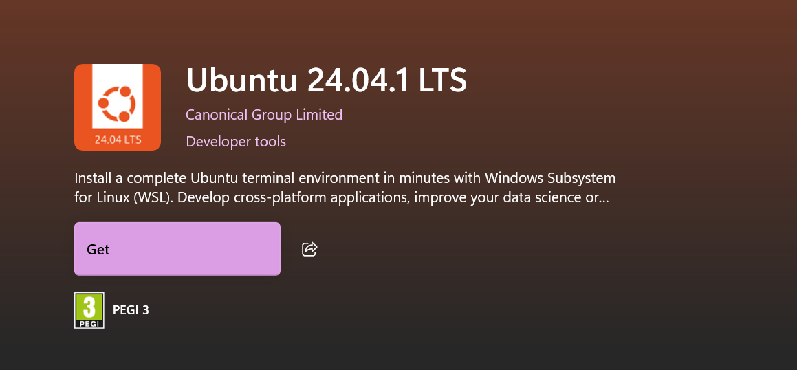

# WSL setup

Before we begin working with ROS2, we need a Linux environment. ROS2 is primarily developed and supported on Linux, and while Windows can run ROS2 in some limited forms, most tutorials, tools, and community support assume you are working inside Ubuntu. On Windows, the easiest way to achieve this is by using **WSL – Windows Subsystem for Linux**.

WSL is a compatibility layer that allows you to run a genuine Linux environment directly on Windows, without the overhead of a full virtual machine. This means you can:

- Install and run **Ubuntu** alongside your normal Windows applications.
- Access Linux tools, compilers, and ROS2 packages while still using Windows for editing code, browsing, and other tasks.
- Share files seamlessly between Windows and Linux.
- Run Docker in integration with WSL, giving you container support in Linux while managing everything from Windows.

For our Bootcamp setup, we specifically choose **Ubuntu 24.04** inside WSL2, because it is the most recent long-term support (LTS) release and works smoothly with ROS2.

[WSL – Windows Subsystem for Linux](https://learn.microsoft.com/en-us/windows/wsl/)

## Enabling WSL on Windows

On most modern versions of Windows 10 and Windows 11, Windows Subsystem for Linux (WSL) is already included, but it may not be enabled by default. To set it up with Ubuntu 24.04, follow these steps:

1. Open **PowerShell as Administrator**. Press **Win + X** and select _Windows PowerShell (Admin)_ from the menu.
2. In the PowerShell window, run the following command:

```powershell
wsl --install -d Ubuntu-24.04
```

- `wsl --install` makes sure that the WSL feature and the WSL2 engine are enabled on your system.

- The `-d Ubuntu-24.04` option tells Windows to install the Ubuntu 24.04 distribution directly.

3. Windows will now download the necessary components and install Ubuntu. If prompted, restart your computer to finish the setup.

#### If the command does not work

On some systems, the `wsl --install` command may fail or may not recognize Ubuntu 24.04. In that case, you can install Ubuntu manually through the Microsoft Store:

- Open the **Microsoft Store** application in Windows.
- Search for **Ubuntu 24.04 LTS**.
- Click **Get** (or **Install**) and wait for the installation to finish.



This method installs the same distribution but uses the graphical interface instead of the command line.

### Setting Up Your Ubuntu User

Once the system restarts, open Ubuntu from the Start menu (just search for _Ubuntu 24.04_). The first time you launch it, the terminal will ask you to create a new Linux username and password.

- This username is separate from your Windows account.
- Choose a simple name (for example, `student`).
- Pick a password that you will remember; you will need it when installing packages with `sudo`.

When you finish, you now have a fully functioning Linux system running inside Windows. From here on, any command you run inside the Ubuntu terminal will behave as if you were on a native Linux machine.

## Installing Docker Desktop and Enabling WSL Integration

Now that Ubuntu 24.04 is running inside WSL, the next step is to install and configure Docker Desktop. Docker allows us to package and run software inside containers. A container is like a lightweight virtual machine that holds everything your project needs to run operating system files, dependencies, libraries, and tools, without affecting the rest of your system.

For ROS2 Bootcamp, Docker ensures that every student has exactly the same environment. This eliminates **“it works on my machine”** problems, because all of you will be building and running ROS2 inside identical containers, regardless of what your underlying Windows installation looks like.

### Installing Docker Desktop

1. Open your browser in Windows and go to docker.com.  
    Alternatively, you can install it directly from the **Microsoft Store** by searching for _Docker Desktop_.
2. Download **Docker Desktop for Windows** and run the installer.
3. During installation, ensure that the option **Use the WSL 2 based engine** is checked. This setting allows Docker to run containers directly in your Ubuntu WSL environment, instead of using the older Hyper-V backend.

After installation, restart your computer if prompted.

### Enabling WSL Integration

Once Docker Desktop is installed, open the application.

1. Go to **Settings → General** and make sure **Use the WSL 2 based engine** is enabled.
2. Navigate to **Settings → Resources → WSL Integration**. You should see a list of installed distributions.
3. Enable Docker integration for **Ubuntu-24.04**. This ensures that when you run `docker` commands from inside your WSL terminal, they will work seamlessly.


At this stage, Docker Desktop and WSL are connected. Windows manages Docker Desktop, but the actual containers and images will run inside your Ubuntu distribution.

### Verifying Docker

To confirm Docker is working correctly, open your Ubuntu terminal and type:

```powershell
docker --version
```

You should see output similar to (docker desktop needs to be open):

```powershell
Docker version 27.1.1, build 12345
```

Now test Docker with the classic hello-world image:

```powershell
docker run hello-world
```


If everything is set up correctly, you will see a message beginning with _“Hello from Docker!”_. This confirms that Docker is installed, integrated with WSL, and capable of running containers.

## Cloning the ROS2 Bootcamp Template

With WSL and Docker ready, it is time to bring in the ROS2 Bootcamp project files. This project contains the code structure, configuration, and Dockerfile needed for our ROS2 development environment. We will begin by downloading (cloning) the project into your Ubuntu environment.

### Why use Git and a template?

Git is a version control system that allows you to manage your code history, collaborate with others, and connect your work to GitHub. In this course, you will not directly work in my GitHub repository. Instead, you will start by cloning the template project into your local machine, remove the link to my GitHub, and then connect the project to your own GitHub account.

This ensures every student has the same starting point, but everyone controls their own repository for commits, branches, and experiments.

### Updating Ubuntu

First, let’s make sure your Ubuntu system is up to date. Open your Ubuntu terminal and run:

```bash
sudo apt update && sudo apt upgrade -y
```

This command updates the list of available packages and upgrades everything already installed.

### Installing Git

If Git is not already installed, run:

```bash
sudo apt install git -y
```

You can check that Git works with:

```bash
git --version
```

The output should show the installed Git version.


### Cloning the Project

Navigate to your home directory and clone the template project:

```bash
cd ~ 
git clone https://github.com/niko-korosec-student/ROS2-Bootcamp.git 
cd ROS2-Bootcamp
```

At this point, your Ubuntu environment has a copy of the ROS2 Bootcamp project. All the necessary files, including the Dockerfile, are in place.

### Disconnecting from the Original Repository

Right now, the project is still linked to original GitHub repository. Since you will be working in your own repository, we need to remove this connection:

```bash
git remote remove origin
```

After this step, the project folder remains fully intact, but it is no longer connected to my GitHub account. You are free to connect it to your own repository in the next step.

# Connecting to Your Own GitHub Repository

Now that you have the ROS2 Bootcamp project cloned into WSL and disconnected from the original repository, it is time to link it to your own GitHub account. This step gives you full control over your code and allows you to track changes, push updates, and share your work with others.

### Why do we do this?

- Each student should **own their code**.
- By creating your own GitHub repository, you are no longer tied to the template source.
- This also helps you practice the standard development workflow used in industry: clone → commit → push → manage history.

### Create a Repository on GitHub

1. Open [GitHub](https://github.com/) in your browser and log in with your account.
2. In the top-right corner, click the **+** icon and select **New repository**.
3. Give your repository a meaningful name, for example:
    - `ros2-bootcamp`
    - `ros2-course-project`
4. Leave it empty (do not add a README, license, or `.gitignore`).
5. Click **Create repository**.

### Configure Git Identity in WSL

Before you can push code to GitHub, Git needs to know who you are. Run these commands in your Ubuntu terminal, replacing with your own name and the email linked to your GitHub account:

```bash
git config --global user.name "Your Name" git config --global user.email "your-email@example.com"
```

Verify your settings with:

```bash
git config --list
```

### Using a Personal Access Token (PAT)

GitHub no longer accepts account passwords for Git operations. Instead, you must use a **Personal Access Token**.

1. Go to [GitHub → Settings → Developer settings → Personal access tokens](https://github.com/settings/tokens).
2. Click **Generate new token (classic)**.
3. Give it a name (e.g., _ROS2 Bootcamp_), set an expiration date, and select the permission:
    - **repo** (full control of repositories).
4. Click **Generate token** and copy it. Save it somewhere secure — you won’t see it again.

### Link Your Local Project to GitHub

Return to your Ubuntu terminal, and make sure you are still inside the project folder:

```bash
cd ~/ROS2-Bootcamp
```

Now, connect it to your new GitHub repository. Replace `<your-username>` and `<your-repo>` with your actual GitHub details:

```bash
git remote add origin https://github.com/<your-username>/<your-repo>.git 
git branch -M main 
git add . 
git commit -m "Initial commit" 
git push -u origin main
```

When you run the last command, Git will ask for login details:

- **Username** → your GitHub username
- **Password** → paste your Personal Access Token

### Saving Credentials

To avoid typing your token every time, enable Git’s credential helper in WSL:

```bash
git config --global credential.helper store
```

After your first successful push, Git will save the token locally and reuse it automatically.

### What Just Happened?

- `git remote add origin ...` linked your local repository to GitHub.
- `git branch -M main` set the default branch to **main** (GitHub’s standard).
- `git add .` staged all the files.
- `git commit -m "Initial commit"` created your first commit.
- `git push -u origin main` uploaded the project to GitHub.

### Confirming on GitHub

Return to GitHub in your browser and refresh your repository page. You should now see all the ROS2 Bootcamp files under your own account.

From now on, any changes you make in WSL can be committed and pushed to **your personal repository**.

# Building and Running the Docker Container

At this point, you have:

- WSL installed with Ubuntu 24.04,
- Docker Desktop running with WSL integration,
- the ROS2 Bootcamp project cloned inside WSL, and
- your own GitHub repository linked.

Now it’s time to build and run the Docker container that will serve as your ROS2 development environment.

Once your project is set up, you don’t need to manually type Docker commands every time.  
The repository already includes configuration files (`.devcontainer/`) that tell VS Code how to build and run the container for you.

1. Open your Ubuntu terminal and go to the project folder:

```bash
cd ~/ROS2-Bootcamp 
code .
```

This launches VS Code with the project opened.

2. Inside VS Code, press **Shift + Ctrl + P** to open the Command Palette.

3. Type **“Rebuild and Reopen in Container”** and press Enter.

VS Code will now:

- Build the Docker image using the provided Dockerfile.
- Start the container automatically.
- Mount your workspace inside the container.

When it’s done, you’ll be inside the container’s shell, ready to work.

### Building the ROS2 Workspace

Inside the VS Code terminal (which is now running in the container), navigate to your workspace:

`cd /workspaces/ROS2-Bootcamp colcon build source install/setup.bash`

You’re now ready to run ROS2 commands like:

`ros2 run turtlesim turtlesim_node`

### Building the ROS2 Workspace

Inside the container, navigate to your workspace:

`cd /workspaces/ROS2-Bootcamp`

Now, build the ROS2 packages:

```bash
colcon build

or

sudo colcon build
```

If the build completes without errors, you have successfully compiled your ROS2 project.

To make ROS2 aware of your packages, source the workspace:

```bash
source install/setup.bash
```
After sourcing, you can run ROS2 commands like `ros2 run` or `ros2 topic list`.

### Verifying the Setup

To verify everything is working, try running the **turtlesim** demo, which was installed in your container:

```
ros2 run turtlesim turtlesim_node
```

A small window with a turtle should appear. If it does, congratulations — your ROS2 development environment is fully operational.


